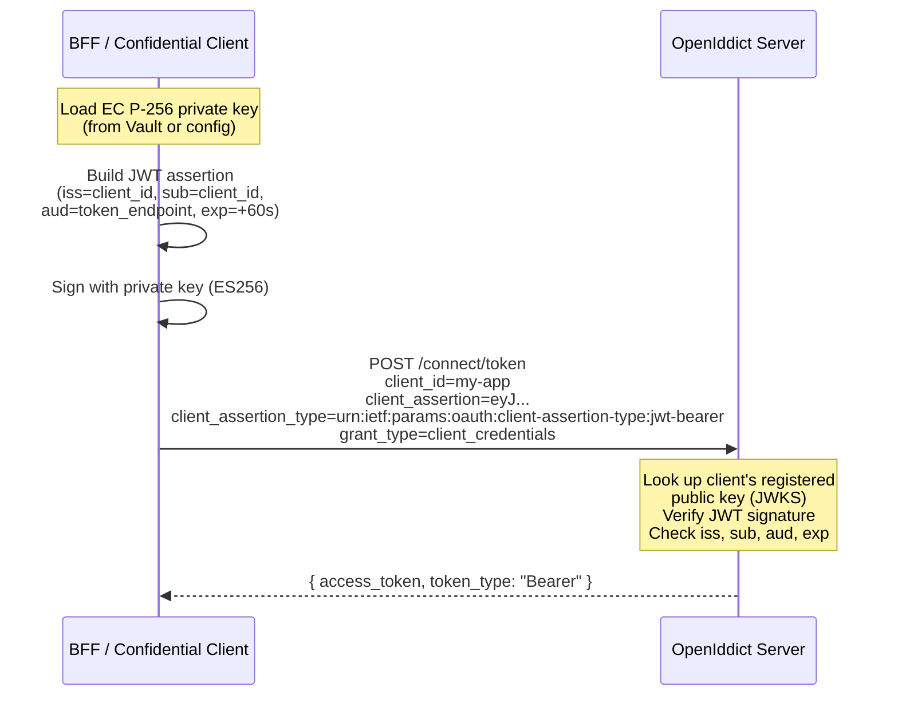

import { Tabs, TabItem, Aside, Steps } from "@astrojs/starlight/components";

Private Key JWT (`private_key_jwt`) is an OAuth 2.0 client authentication method
defined in [RFC 7523](https://www.rfc-editor.org/rfc/rfc7523) and referenced by
[OpenID Connect Core Section 9](https://openid.net/specs/openid-connect-core-1_0.html#ClientAuthentication).
Instead of sending a shared `client_secret`, the client proves its identity by
signing a JWT with its private key. The authorization server validates the
signature using the client's pre-registered public key.

## The problem with shared secrets

The default `client_secret_post` method sends the secret in every token request:

```text
POST /connect/token
Content-Type: application/x-www-form-urlencoded

grant_type=client_credentials
&client_id=my-app
&client_secret=super-secret-value
```

This creates several risks:

- **Secret leakage** — the secret appears in POST bodies, potentially logged by proxies or WAFs
- **Secret rotation** — changing a secret requires coordinated deployment of both client and server
- **Shared knowledge** — both parties know the secret, making attribution difficult after a breach
- **Credential stuffing** — stolen secrets can be replayed from any network location

## How `private_key_jwt` solves this

The client generates a short-lived JWT assertion signed with its private key.
The server only stores the public key and verifies the signature — no shared
secret ever crosses the network.



<Steps>

1. **Key generation** — The client generates an EC P-256 (or RSA) key pair
   offline. The private key is stored securely (Vault, HSM, or encrypted config).
   The public key is registered with the authorization server.

2. **Assertion creation** — On each token request, the client builds a JWT with
   `iss` and `sub` set to the client ID, `aud` set to the token endpoint URL,
   a unique `jti`, and a short `exp` (60 seconds in Granit).

3. **Signature** — The JWT is signed with the private key using ES256 (EC) or
   PS256 (RSA).

4. **Token request** — The signed assertion is sent as `client_assertion`
   alongside `client_assertion_type=urn:ietf:params:oauth:client-assertion-type:jwt-bearer`.

5. **Server validation** — OpenIddict retrieves the client's registered JWKS,
   verifies the JWT signature, and validates the claims (`iss`, `sub`, `aud`,
   `exp`, `jti`).

</Steps>

## Client assertion JWT structure

Each assertion is a short-lived JWT signed by the client's private key:

**Header:**

```json
{
  "typ": "client-authentication+jwt",
  "alg": "ES256"
}
```

**Payload:**

```json
{
  "iss": "my-app",
  "sub": "my-app",
  "aud": "https://auth.example.com/connect/token",
  "jti": "a1b2c3d4e5f6",
  "iat": 1711148400,
  "exp": 1711148460
}
```

| Claim | Required | Description |
|-------|----------|-------------|
| `iss` | Yes | Client ID (issuer of the assertion) |
| `sub` | Yes | Client ID (subject of the assertion) |
| `aud` | Yes | Token endpoint URL (audience) |
| `jti` | Yes | Unique token ID (prevents replay) |
| `iat` | Yes | Issued-at timestamp |
| `exp` | Yes | Expiration (60 seconds in Granit) |

<Aside type="note" title="Assertion lifetime">
Granit generates assertions with a 60-second lifetime. Each token request gets
a fresh assertion — assertions are never reused. The `jti` claim ensures
uniqueness even if two assertions are generated in the same second.
</Aside>

## Configuration

### Key generation

Generate an EC P-256 key pair using OpenSSL:

```bash
# Generate EC P-256 private key
openssl ecparam -name prime256v1 -genkey -noout -out client-key.pem

# Export as JWK (requires step-cli or similar tool)
step crypto key format --jwk < client-key.pem > client-key.jwk

# Extract public key only (for server registration)
step crypto key format --jwk --no-password < client-key.pem \
  | jq 'del(.d)' > client-key-pub.jwk
```

Or using .NET:

```csharp
using System.Security.Cryptography;
using System.Text.Json;

using var ecdsa = ECDsa.Create(ECCurve.NamedCurves.nistP256);
ECParameters parameters = ecdsa.ExportParameters(includePrivateParameters: true);

// Private key JWK (store in Vault — never in appsettings.json)
string privateJwk = JsonSerializer.Serialize(new
{
    kty = "EC", crv = "P-256",
    x = Base64UrlEncode(parameters.Q.X!),
    y = Base64UrlEncode(parameters.Q.Y!),
    d = Base64UrlEncode(parameters.D!),
});

// Public key JWK (register on the OIDC server)
string publicJwk = JsonSerializer.Serialize(new
{
    kty = "EC", crv = "P-256",
    x = Base64UrlEncode(parameters.Q.X!),
    y = Base64UrlEncode(parameters.Q.Y!),
});
```

### OpenIddict server — seeding with public key

Register the client's public key using `OidcApplicationSeedDescriptor.SigningKeyJwk`:

```json
{
  "OpenIddict": {
    "Seeding": {
      "Applications": [
        {
          "ClientId": "my-bff",
          "ClientSecret": null,
          "DisplayName": "My BFF (private_key_jwt)",
          "SigningKeyJwk": "{\"kty\":\"EC\",\"crv\":\"P-256\",\"x\":\"...\",\"y\":\"...\"}",
          "Permissions": [
            "ept:token", "ept:authorization", "ept:pushed_authorization",
            "gt:authorization_code", "gt:refresh_token", "rst:code",
            "scp:openid", "scp:profile", "scp:email"
          ],
          "RedirectUris": ["https://app.example.com/bff/callback"],
          "PostLogoutRedirectUris": ["https://app.example.com/"]
        }
      ]
    }
  }
}
```

Or in code:

```csharp
new OidcApplicationSeedDescriptor(
    ClientId: "my-bff",
    ClientSecret: null,    // No shared secret needed
    DisplayName: "My BFF (private_key_jwt)",
    Permissions:
    [
        "ept:token", "ept:authorization", "ept:pushed_authorization",
        "gt:authorization_code", "gt:refresh_token", "rst:code",
        "scp:openid", "scp:profile", "scp:email",
    ],
    RedirectUris: ["https://app.example.com/bff/callback"],
    PostLogoutRedirectUris: ["https://app.example.com/"],
    SigningKeyJwk: publicKeyJwkJson)
```

<Aside type="caution" title="Public key only">
The `SigningKeyJwk` field must contain only the **public key** (no `d` parameter
for EC, no `d`/`p`/`q` for RSA). The seed contributor automatically strips
private key parameters as a safety net, but you should never include them in
configuration files.
</Aside>

### BFF integration

Configure the BFF frontend to use `private_key_jwt` instead of `client_secret_post`:

```json
{
  "Bff": {
    "Frontends": [
      {
        "Name": "admin",
        "ClientId": "my-bff",
        "ClientAuthenticationMethod": "PrivateKeyJwt",
        "ClientSigningKeyJwk": "{\"kty\":\"EC\",\"crv\":\"P-256\",\"x\":\"...\",\"y\":\"...\",\"d\":\"...\"}"
      }
    ]
  }
}
```

<Aside type="caution" title="Private key in production">
Never store `ClientSigningKeyJwk` in `appsettings.json` for production. The
private key must come from [Granit.Vault](/dotnet/data/vault/)
or an environment variable:

```bash
export Bff__Frontends__0__ClientSigningKeyJwk='{"kty":"EC","crv":"P-256",...,"d":"..."}'
```

</Aside>

When `ClientAuthenticationMethod` is set to `PrivateKeyJwt`, the BFF:

- Builds a fresh JWT assertion for every token request (login, refresh, PAR)
- Signs the assertion with the configured private key (ES256 for EC, PS256 for RSA)
- Sends `client_assertion` + `client_assertion_type` instead of `client_secret`
- Omits the `client_secret` parameter entirely

## Shared secret vs `private_key_jwt` comparison

<Tabs>
<TabItem label="client_secret_post (default)">

```text
POST /connect/token
Content-Type: application/x-www-form-urlencoded

grant_type=client_credentials
&client_id=my-app
&client_secret=super-secret-value

Secret visible in POST body.
Leaked secret = full impersonation until rotated.
Rotation requires coordinated redeployment.
```

</TabItem>
<TabItem label="private_key_jwt (FAPI 2.0)">

```text
POST /connect/token
Content-Type: application/x-www-form-urlencoded

grant_type=client_credentials
&client_id=my-app
&client_assertion=eyJ0eXAiOiJjbGllbnQtYXV0aGVudGljYXRpb24...
&client_assertion_type=urn:ietf:params:oauth:client-assertion-type:jwt-bearer

No secret on the wire.
Assertion is single-use, short-lived (60s), and audience-bound.
Key rotation: register new public key, deploy new private key independently.
```

</TabItem>
</Tabs>

## Security considerations

| Threat | `client_secret_post` | `private_key_jwt` |
|--------|---------------------|-------------------|
| Secret logged by proxy/WAF | Secret in POST body | No secret on the wire |
| Credential replay | Secret valid until rotated | Assertion expires in 60s |
| Server-side breach | Attacker gets hashed secret | Attacker gets public key (useless) |
| Key rotation | Coordinated deployment | Independent: new public key on server, new private key on client |
| Attribution after breach | Both parties know the secret | Only the client holds the private key |
| Credential stuffing | Possible with stolen secret | Impossible without private key |

## Key management

| Aspect | Granit implementation |
|--------|---------------------|
| **Algorithms** | EC P-256 (ES256) — recommended; RSA (PS256) — supported |
| **Key lifetime** | Long-lived (rotate annually or per security policy) |
| **Private key storage** | Vault, HSM, or encrypted environment variable |
| **Public key storage** | OpenIddict application JWKS (via `SigningKeyJwk` seeding) |
| **Assertion lifetime** | 60 seconds per assertion JWT |
| **Assertion uniqueness** | `jti` claim (random GUID per assertion) |

<Aside type="tip" title="EC P-256 recommended">
EC P-256 keys are smaller (32 bytes vs 256+ bytes for RSA), faster to sign,
and produce shorter JWTs. FAPI 2.0 recommends ES256. Use RSA (PS256) only
when regulatory requirements mandate it.
</Aside>

## FAPI 2.0 compliance

`private_key_jwt` is one of two client authentication methods allowed by the
[FAPI 2.0 Security Profile](https://openid.net/specs/fapi-2_0-security-profile.html)
(the other being mTLS). Combined with
[PAR](/dotnet/security/openiddict/advanced/pushed-authorization-requests/) and
[DPoP](/dotnet/security/openiddict/advanced/proof-of-possession-dpop/), it provides
a complete FAPI 2.0-compliant flow:

| Mechanism | Protects | RFC |
|-----------|---------|-----|
| **PKCE** | Authorization code interception | RFC 7636 |
| **PAR** | Authorization parameter tampering + PII leakage | RFC 9126 |
| **DPoP** | Token replay + theft | RFC 9449 |
| **`private_key_jwt`** | Client authentication without shared secrets | RFC 7523 |

Enable all four for maximum security:

```json
{
  "Bff": {
    "Frontends": [
      {
        "Name": "admin",
        "ClientAuthenticationMethod": "PrivateKeyJwt",
        "ClientSigningKeyJwk": "{...private key JWK...}",
        "UsePushedAuthorizationRequests": true,
        "UseDPoP": true
      }
    ]
  }
}
```

PKCE is enforced by default (`RequireProofKeyForCodeExchange`).

## See also

- [PAR (Pushed Authorization Requests)](/dotnet/security/openiddict/advanced/pushed-authorization-requests/) — move parameters to back-channel
- [DPoP (Proof-of-Possession)](/dotnet/security/openiddict/advanced/proof-of-possession-dpop/) — bind tokens to cryptographic keys
- [DPoP Resource Server Validation](/dotnet/security/openiddict/advanced/dpop-resource-server-validation/) — validate DPoP proofs on any IdP
- [FAPI 2.0 Security Profile](/dotnet/security/openiddict/advanced/fapi-2-security-profile/) — full conformance checklist
- [OIDC Client Primitives](/dotnet/security/authentication-oidc/) — `IClientAuthenticationStrategy`, typed requests
- [Token Management](/dotnet/security/token-management/) — `private_key_jwt` for service-to-service
- [OIDC Server Configuration](/dotnet/security/openiddict/openid-connect-server/) — endpoints and flows overview
- [BFF Configuration](/dotnet/security/bff/configuration/) — frontend options reference
