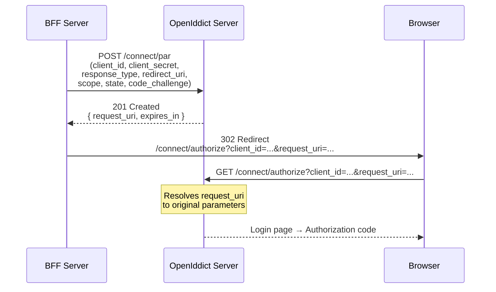

import { Tabs, TabItem, Aside, Steps } from "@astrojs/starlight/components";

Pushed Authorization Requests (PAR) is an OAuth 2.0 extension defined in
[RFC 9126](https://www.rfc-editor.org/rfc/rfc9126) that moves authorization
parameters from the browser URL to a server-to-server POST request. This
prevents parameter tampering, reduces URL length, and hides sensitive data
(scopes, redirect URIs, PKCE challenges) from the browser address bar.

## Why PAR matters

In a standard authorization code flow, all parameters are visible in the
browser URL:

```text
/connect/authorize?client_id=my-app&response_type=code&scope=openid+profile+email
  &redirect_uri=https://app.example.com/callback&state=abc123
  &code_challenge=E9Melhoa2OwvFrEMTJguCHaoeK1t8URWbuGJSstw-cM
  &code_challenge_method=S256
```

An attacker with browser access can:

- **Inspect** parameters (leaking scopes, redirect URIs, client IDs)
- **Tamper** with parameters (modifying scopes, injecting malicious redirect URIs)
- **Trigger URL truncation** (complex requests exceed URL length limits)

PAR eliminates all three risks by pushing parameters server-side first.

## How it works



<Steps>

1. **Push parameters** — The BFF (or any confidential client) POSTs all
   authorization parameters to `/connect/par` with client authentication.

2. **Receive request_uri** — The server validates the request, stores the
   parameters, and returns an opaque `request_uri` (valid for a short time).

3. **Redirect with request_uri** — The browser is redirected to
   `/connect/authorize` with only `client_id` and `request_uri` — no
   sensitive parameters in the URL.

4. **Normal flow continues** — The authorization server resolves the
   `request_uri`, authenticates the user, and issues an authorization code
   as usual.

</Steps>

## Configuration

### Server-side

The PAR endpoint (`/connect/par`) is **always available** — registered
automatically by `AddGranitOpenIddict()`. No additional
server configuration is needed for optional PAR.

To **require** PAR for all authorization code flows (reject direct requests
without a `request_uri`):

```json
{
  "OpenIddict": {
    "RequirePar": true
  }
}
```

<Aside type="tip" title="Client permissions">
Each OIDC application must have the `ept:pushed_authorization` permission
to use the PAR endpoint. Add it to the seeding configuration:

```csharp
new OidcApplicationSeedDescriptor("my-app", "secret", "My App",
    [
        "ept:authorization", "ept:token", "ept:pushed_authorization",
        "gt:authorization_code", "gt:refresh_token", "rst:code",
        "scp:openid", "scp:profile", "scp:email",
    ],
    redirectUris, postLogoutRedirectUris)
```

</Aside>

### BFF integration

Enable PAR on a frontend to automatically push parameters before redirecting:

```json
{
  "Bff": {
    "Frontends": [
      {
        "Name": "admin",
        "UsePushedAuthorizationRequests": true
      }
    ]
  }
}
```

When enabled, the BFF login flow:

1. POSTs all authorization parameters to `/connect/par`
2. Receives `request_uri` from the server
3. Redirects the browser with only `client_id` + `request_uri`
4. Falls back to direct parameters if PAR fails (graceful degradation)

## PAR response format

A successful PAR request returns `201 Created` with a JSON body:

```json
{
  "request_uri": "urn:openiddict:params:request:abc123def456",
  "expires_in": 60
}
```

| Field | Type | Description |
|-------|------|-------------|
| `request_uri` | `string` | Opaque reference to the stored authorization parameters |
| `expires_in` | `int` | Seconds until the `request_uri` expires (typically 60s) |

<Aside type="caution" title="request_uri lifetime">
The `request_uri` is single-use and short-lived. If the user takes too long to
complete the login (e.g., reading a consent screen), the `request_uri` may expire.
The BFF handles this gracefully by falling back to direct parameters.
</Aside>

## Error handling

| Status | Error | Cause |
|--------|-------|-------|
| `400 Bad Request` | `invalid_request` | Missing or malformed parameters |
| `400 Bad Request` | `invalid_client` | Missing or invalid client authentication |
| `400 Bad Request` | `invalid_redirect_uri` | Redirect URI not registered for this client |
| `403 Forbidden` | `insufficient_scope` | Client lacks `ept:pushed_authorization` permission |

## Traditional vs PAR flow comparison

<Tabs>
<TabItem label="Traditional (insecure)">

```text
Browser URL (visible, tamperable):
/connect/authorize
  ?client_id=my-app
  &response_type=code
  &scope=openid profile email offline_access
  &redirect_uri=https://app.example.com/callback
  &state=xyzSecretState123
  &code_challenge=E9Melhoa2OwvFrEMTJguCHaoeK1t8URWbuGJSstw-cM
  &code_challenge_method=S256
```

All parameters visible in browser history, logs, and referrer headers.

</TabItem>
<TabItem label="PAR (secure)">

```text
Browser URL (opaque, untamperable):
/connect/authorize
  ?client_id=my-app
  &request_uri=urn:openiddict:params:request:abc123
```

Parameters pushed server-side. Only the opaque `request_uri` is in the URL.

</TabItem>
</Tabs>

## Security considerations

| Threat | Mitigation |
|--------|------------|
| Parameter tampering in URL | Parameters are server-side, not in URL |
| PII leakage via browser history | Only opaque `request_uri` in URL |
| URL truncation (long scopes) | Parameters sent via POST body |
| Replay of `request_uri` | Short-lived (typically 60 seconds), single-use |
| Unauthorized PAR requests | Client authentication required on `/connect/par` |
| Man-in-the-browser | Combined with PKCE, provides defense in depth |

## FAPI 2.0 compliance

PAR is **mandatory** in the
[FAPI 2.0 Security Profile](https://openid.net/specs/fapi-2_0-security-profile.html)
alongside [DPoP](/dotnet/security/openiddict/advanced/proof-of-possession-dpop/) and PKCE.
Industries requiring FAPI 2.0 include:

- **Open Banking** (PSD2, UK Open Banking)
- **Healthcare** (HL7 SMART on FHIR)
- **Government** (eIDAS, Digital Identity)
- **Insurance** (ACORD standards)

## See also

- [Private Key JWT Authentication](/dotnet/security/openiddict/advanced/private-key-jwt-authentication/) — eliminate shared secrets
- [DPoP (Proof-of-Possession)](/dotnet/security/openiddict/advanced/proof-of-possession-dpop/) — bind tokens to cryptographic keys
- [DPoP Resource Server Validation](/dotnet/security/openiddict/advanced/dpop-resource-server-validation/) — validate DPoP proofs on any IdP
- [FAPI 2.0 Security Profile](/dotnet/security/openiddict/advanced/fapi-2-security-profile/) — full conformance checklist
- [OIDC Client Primitives](/dotnet/security/authentication-oidc/) — typed requests, discovery, PKCE
- [OIDC Server Configuration](/dotnet/security/openiddict/openid-connect-server/) — endpoints and flows overview
- [BFF Configuration](/dotnet/security/bff/configuration/) — frontend options reference
- [Configuration Reference](/dotnet/security/openiddict/configuration/) — `RequirePar` option
