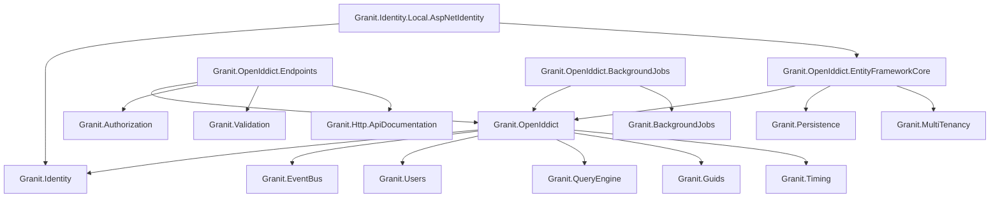

import { Tabs, TabItem, FileTree, Badge } from "@astrojs/starlight/components";

Granit.OpenIddict transforms any Granit application into a **self-hosted OpenID Connect
authorization server** with full user management. Built on
[OpenIddict 7](https://openiddict.com/), ASP.NET Core Identity, and EF Core 10.

Designed for the Granit module system with multi-tenant isolation, per-tenant
configuration via Granit.Settings, and Wolverine-based background jobs.

## Why self-hosted?

Granit.Identity delegates authentication to external providers (Keycloak, Cognito, Entra ID).
Granit.OpenIddict is the alternative: **your application IS the identity provider**.

| | External (Keycloak, etc.) | Self-hosted (OpenIddict) |
|---|---|---|
| **User store** | External system | Your database |
| **User management** | External admin UI | Your API (`/api/admin/users`) |
| **Customization** | Limited by provider | Full control |
| **Deployment** | Separate service | Same process |
| **Multi-tenancy** | Provider-dependent | Built-in (`IMultiTenant`) |
| **Data residency** | Provider's infra | Your infrastructure |
| **Compliance** | Delegated | Full ownership (GDPR, ISO 27001) |

## Package structure

<FileTree>
- Granit.OpenIddict/ Abstractions, entities, options, permissions, events
  - Granit.OpenIddict.EntityFrameworkCore/ DbContext, OpenIddict server, seeding
  - Granit.Identity.Local.AspNetIdentity/ IIdentityProvider bridge (AspNetIdentityProvider)
  - Granit.OpenIddict.Endpoints/ Account self-service + admin REST API
  - Granit.OpenIddict.BackgroundJobs/ Token cleanup + idle session enforcement
  - Granit.Bundle.OpenIddict/ Meta-package (pulls all packages)
</FileTree>

| Package | Responsibility |
|---------|----------------|
| `Granit.OpenIddict` | Abstractions, entities, options, permissions, integration events, diagnostics |
| `Granit.OpenIddict.EntityFrameworkCore` | `OpenIddictDbContext`, server configuration, seed contributor, host builder extension |
| `Granit.Identity.Local.AspNetIdentity` | `AspNetIdentityProvider` implementing all 7 `IIdentityProvider` sub-interfaces |
| `Granit.OpenIddict.Endpoints` | 40+ REST endpoints (account self-service + admin management) |
| `Granit.OpenIddict.BackgroundJobs` | `[RecurringJob]` for token cleanup and idle session enforcement |
| `Granit.Bundle.OpenIddict` | `GranitBuilder.AddOpenIddict()` convenience meta-package |

## Dependency graph



## Quick start

### 1. Add the bundle

```xml
<PackageReference Include="Granit.Bundle.OpenIddict" />
```

Or add packages individually for fine-grained control:

```bash
dotnet add package Granit.OpenIddict.EntityFrameworkCore
dotnet add package Granit.OpenIddict.Endpoints
dotnet add package Granit.OpenIddict.BackgroundJobs
dotnet add package Granit.Identity.OpenIddict
```

### 2. Register modules

```csharp
[DependsOn(
    typeof(GranitIdentityLocalAspNetIdentityModule),
    typeof(GranitOpenIddictBackgroundJobsModule),
    typeof(GranitOpenIddictEndpointsModule),
    typeof(GranitOpenIddictEntityFrameworkCoreModule))]
public sealed class MyAppModule : GranitModule;
```

### 3. Configure services

```csharp
// Program.cs
builder.AddGranitOpenIddict(options =>
    options.UseNpgsql(builder.Configuration.GetConnectionString("Identity")));
```

### 4. Configure middleware (order matters)

```csharp
app.UseAuthentication();
app.UseOpenIddict();       // MUST be between Authentication and Authorization
app.UseAuthorization();

api.MapGranitOpenIddict();
```

### 5. Run migrations

Include `ConfigureOpenIddictModule()` in your host `DbContext.OnModelCreating`,
then generate a migration and run it:

```bash
dotnet ef migrations add AddOpenIddict
dotnet run --migrate
```

In SchemaPerTenant mode, tables are created in the host schema.

### 6. Seed an application

```json
{
  "OpenIddict": {
    "Seeding": {
      "Applications": [
        {
          "ClientId": "my-spa",
          "ClientSecret": null,
          "DisplayName": "My SPA",
          "Permissions": [
            "ept:authorization", "ept:token", "ept:logout",
            "gt:authorization_code", "gt:refresh_token",
            "scp:openid", "scp:profile", "scp:email", "scp:offline_access"
          ],
          "RedirectUris": ["https://localhost:5173/callback"],
          "PostLogoutRedirectUris": ["https://localhost:5173"]
        }
      ]
    }
  }
}
```

## OpenID Connect compliance

| Specification | Support |
|---------------|---------|
| OAuth 2.0 (RFC 6749) | <Badge text="Full" variant="success" /> |
| Authorization Code + PKCE (RFC 7636) | <Badge text="Full" variant="success" /> |
| Client Credentials | <Badge text="Full" variant="success" /> |
| Refresh Tokens | <Badge text="Full" variant="success" /> |
| Device Authorization (RFC 8628) | <Badge text="Full" variant="success" /> |
| Token Introspection (RFC 7662) | <Badge text="Full" variant="success" /> |
| Token Revocation (RFC 7009) | <Badge text="Full" variant="success" /> |
| RP-Initiated Logout | <Badge text="Full" variant="success" /> |
| Discovery (`/.well-known/openid-configuration`) | <Badge text="Full" variant="success" /> |
| Pushed Authorization Requests (RFC 9126) | <Badge text="Full" variant="success" /> |
| DPoP — Proof-of-Possession (RFC 9449) | <Badge text="Full" variant="success" /> |
| JWT-Secured Authorization Requests (RFC 9101) | <Badge text="Full" variant="success" /> |
| Token Exchange (RFC 8693) | <Badge text="Opt-in" variant="note" /> |
| private_key_jwt (RFC 7523) | <Badge text="Full" variant="success" /> |
| Authorization Response Issuer Verification (RFC 9207) | <Badge text="Full" variant="success" /> |
| Back-Channel Logout (OIDC) | <Badge text="Full" variant="success" /> |
| FAPI 2.0 Security Profile | <Badge text="Full" variant="success" /> |
| Reference Tokens | <Badge text="Opt-in" variant="note" /> |
| Passkeys / WebAuthn (FIDO2) | <Badge text="Custom grant" variant="note" /> |
| TOTP Two-Factor | <Badge text="Custom grant" variant="note" /> |

## Key design decisions

### No ISoftDeletable on GranitUser

`GranitUser` extends `IdentityUser<Guid>` which is managed by ASP.NET Core Identity's
`UserManager<T>`. The `UserManager` uses reflection and metadata patterns that are
incompatible with the `ISoftDeletable` interface. Instead, `GranitUser` has manual
`IsDeleted` / `DeletedAt` / `DeletedBy` fields with an explicit named query filter
registered in `ConfigureOpenIddictModule()`. The filter follows the same
`bypass || real` pattern as `ApplyGranitConventions` so that
`IDataFilter.Disable<ISoftDeletable>()` works consistently.

### No IConcurrencyAware

ASP.NET Core Identity manages its own `ConcurrencyStamp` property on `IdentityUser<TKey>`.
Adding `IConcurrencyAware` would create a second, conflicting concurrency mechanism.

### Entity caching disabled by default

OpenIddict's entity cache uses `ClientId` as the sole cache key. In multi-tenant setups,
two tenants with the same `ClientId` would share cached data (cross-tenant pollution).
`EnableEntityCaching` defaults to `false`. Enable only for single-tenant deployments.

### Table prefix: openiddict\_

All Identity and OpenIddict tables use the `openiddict_` prefix (configurable via
`GranitOpenIddictDbProperties.DbTablePrefix`) to avoid collisions with other
modules sharing the same database.

### Roles are global

`GranitRole` is intentionally not tenant-scoped. Roles are shared globally across all
tenants so that a single RBAC matrix applies platform-wide. Tenant-specific access
is enforced at the permission/policy level, not at the role definition level.

### Do NOT add Granit.Identity.Federated.EntityFrameworkCore

When using `Granit.Identity.Local.AspNetIdentity`, **do not add** `Granit.Identity.Federated.EntityFrameworkCore`.
`GranitUser` is the source of truth — `UserCacheEntry` and `UserCacheSyncMiddleware` are
unnecessary and create data duplication risk. A warning is logged at startup if both
packages are detected. See [ADR-019](/dotnet/architecture/adr/019-user-lookup-dual-mode/)
for the full rationale.

## Integration events

The module publishes three integration events via `IDistributedEventBus` (Wolverine outbox):

| Event | When | Consumers |
|-------|------|-----------|
| `UserRegisteredEto` | New user registration | Onboarding workflows, CRM sync |
| `AccountDeletedEto` | GDPR account deletion | Data cleanup across modules |
| `UserImpersonatedEto` | Admin impersonation | Transparency notification, audit log |

## Next steps

- [OIDC Server Configuration](./openid-connect-server/) -- flows, endpoints, signing keys
- [User Management](./user-management/) -- entities, admin API, IIdentityProvider bridge
- [Account Self-service API](./account-management-api/) -- registration, 2FA, GDPR
- [Advanced Features](./advanced/) -- multi-tenancy, impersonation, passkeys, idle sessions
- [Configuration Reference](./configuration/) -- all options with JSON examples
