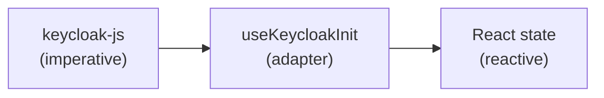

## Definition

The Adapter pattern converts a third-party library's API into a React-compatible
interface. It isolates application code from library details — transforming
imperative callbacks and mutable state into reactive hooks with typed state.

## Diagram



## Implementation in Granit

| Source | Adapter | Target |
|--------|---------|--------|
| `keycloak-js` API | `useKeycloakInit` hook | Reactive `{ authenticated, loading, user }` state |
| `klaro/dist/klaro-no-css` | `createKlaroCookieConsentProvider()` | `CookieConsentProvider` interface |

### Keycloak adaptation

| keycloak-js native | Adapted interface |
|--------------------|-------------------|
| `keycloak.init({ onLoad, pkceMethod })` | Single `useEffect` with init guard |
| `keycloak.loadUserInfo()` → Promise | `user: KeycloakUserInfo \| null` (state) |
| `keycloak.onTokenExpired = callback` | Automatic renewal every 60s |
| `keycloak.token` (mutable string) | Transparent wiring to `setTokenGetter()` |
| `keycloak.authenticated` (mutable bool) | `authenticated: boolean` (reactive) |

## Rationale

Keycloak-js uses callbacks, promises, and mutable properties — a paradigm
mismatch with React's declarative model. The adapter bridges this gap so that
the rest of the application works with standard React state.

## Usage example

```tsx
import { useKeycloakInit } from '@granit/react-authentication';

function AuthProvider({ children }: { children: React.ReactNode }) {
  const { authenticated, loading, user, login, logout } = useKeycloakInit({
    url: import.meta.env.VITE_KEYCLOAK_URL,
    realm: import.meta.env.VITE_KEYCLOAK_REALM,
    clientId: import.meta.env.VITE_KEYCLOAK_CLIENT_ID,
  });

  if (loading) return <Spinner />;
  if (!authenticated) { login(); return null; }

  return (
    <AuthContext.Provider value={{ authenticated, user, login, logout }}>
      {children}
    </AuthContext.Provider>
  );
}
```

## Further reading

- [Adapter — refactoring.guru](https://refactoring.guru/design-patterns/adapter)
