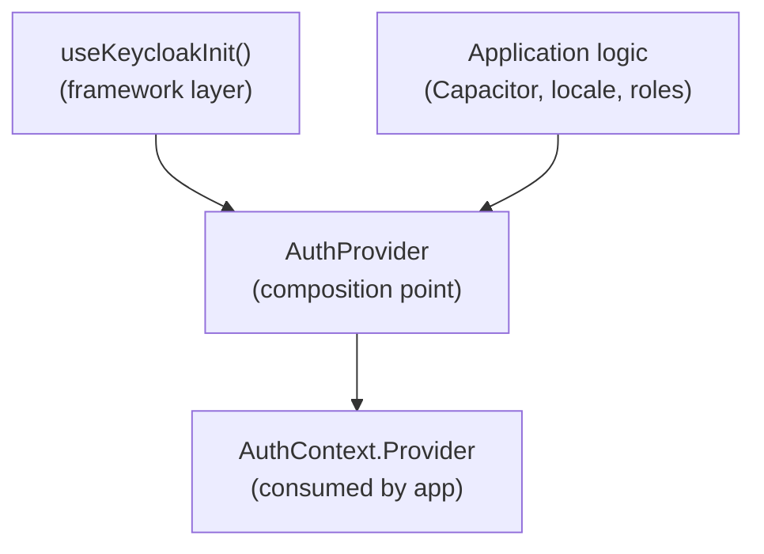

## Definition

Hook Composition assembles low-level framework hooks with application logic in
a wrapper component. The framework hook provides the foundation (authentication,
state, lifecycle); the application adds its business logic on top.

## Diagram



## Implementation in Granit

| Framework hook | Application layer adds | Composition point |
|---------------|----------------------|-------------------|
| `useKeycloakInit` | Capacitor browser, locale, custom redirects | `AuthProvider` in consumer app |
| `useNotificationContext` | Custom toast rendering, sound effects | Notification wrapper component |
| `useQueryEndpoint` | Domain-specific column transforms | Data table component |

## Rationale

Framework hooks must remain generic — no Capacitor, Electron, or app-specific
code. Hook Composition lets applications extend framework behavior without
modifying the framework. The boundary is clear: framework hooks handle the
universal lifecycle, application wrappers add the specific logic.

## Usage example

### Minimal composition (web-only)

```tsx
function AuthProvider({ children }: { children: React.ReactNode }) {
  const auth = useKeycloakInit({
    url: import.meta.env.VITE_KEYCLOAK_URL,
    realm: import.meta.env.VITE_KEYCLOAK_REALM,
    clientId: import.meta.env.VITE_KEYCLOAK_CLIENT_ID,
  });

  if (auth.loading) return <Spinner />;

  return (
    <AuthContext.Provider value={auth}>
      {children}
    </AuthContext.Provider>
  );
}
```

### Advanced composition (Capacitor + custom login)

```tsx
function AuthProvider({ children }: { children: React.ReactNode }) {
  // Framework layer
  const {
    keycloak, keycloakRef, authenticated, loading, user,
    login: hookLogin, logout: hookLogout,
  } = useKeycloakInit(config);

  // Application layer — platform-specific logic
  const login = useCallback(async () => {
    if (isNative) {
      const url = keycloakRef.current?.createLoginUrl({ redirectUri });
      await Browser.open({ url });  // Capacitor: system browser
    } else {
      hookLogin({ locale });
    }
  }, [isNative, keycloakRef, hookLogin]);

  // Stabilization for context consumers
  const value = useMemo(
    () => ({ keycloak, authenticated, loading, user, login, logout }),
    [keycloak, authenticated, loading, user, login, logout],
  );

  return <AuthContext.Provider value={value}>{children}</AuthContext.Provider>;
}
```

The framework `useKeycloakInit` handles Keycloak init, PKCE, token refresh, and
React state. The application wrapper adds Capacitor-specific login flow and
`useMemo` stabilization — without any change to the framework hook.

## Further reading

- [Custom Hooks — react.dev](https://react.dev/learn/reusing-logic-with-custom-hooks)
