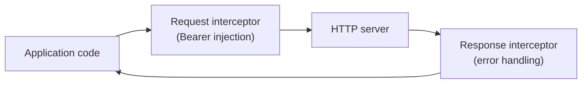

## Definition

The Interceptor pattern inserts transparent processing into a request/response
pipeline. Calling code is unaware of the interceptor — it sends a request and
receives a response as if nothing intervened.

## Diagram



## Implementation in Granit

| Interceptor | Package | Purpose |
|-------------|---------|---------|
| Request — Bearer token | `@granit/api-client` | Automatic `Authorization` header injection |
| Request — Idempotency key | `@granit/idempotency` | Automatic `Idempotency-Key` header on POST/PATCH |
| Response — error handling | Application | 401/403 redirect, error normalization |

The framework handles token injection. Error handling (401, 403, network failures)
is the application's responsibility — this separation is by design.

## Rationale

Bearer token injection must happen on every authenticated request. Making this
an interceptor means no API call site needs to handle authentication manually.
The pipeline is extensible — applications add their own interceptors for error
handling without modifying framework code.

## Usage example

```ts
import { createApiClient } from '@granit/api-client';
import axios from 'axios';

const api = createApiClient({ baseURL: import.meta.env.VITE_API_URL });

// Framework interceptor already in place — calls are transparent
const { data } = await api.get('/patients');

// Application adds its own response interceptor
api.interceptors.response.use(
  (response) => response,
  async (error: unknown) => {
    if (axios.isAxiosError(error) && error.response?.status === 401) {
      window.location.href = '/login';
    }
    throw error;
  },
);
```

## Further reading

- [Interceptor — Wikipedia](https://en.wikipedia.org/wiki/Interceptor_pattern)
