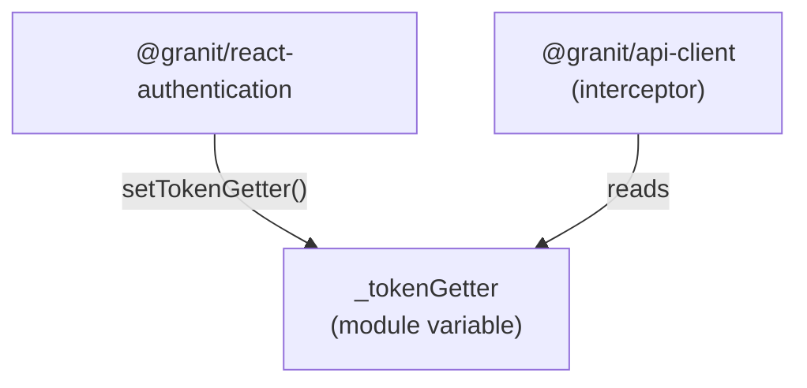

## Definition

The Module Singleton pattern exploits the ES module cache to maintain a unique
global state. A private module variable is shared by all importers — no static
class or global registry required.

## Diagram



## Implementation in Granit

| Singleton variable | Package | Purpose |
|-------------------|---------|---------|
| `_tokenGetter` | `@granit/api-client` | Bearer token getter shared between auth and HTTP client |
| Global log level | `@granit/logger` | Shared log level across all logger instances |

## Rationale

Token management requires coordination between `@granit/react-authentication`
(which obtains tokens from Keycloak) and `@granit/api-client` (which injects
them into HTTP requests). A module singleton avoids direct package coupling —
the auth package calls `setTokenGetter()` once during startup, and the
interceptor reads it on every request.

## Usage example

```ts
// @granit/api-client — private module variable
let _tokenGetter: (() => Promise<string | undefined>) | null = null;

export function setTokenGetter(
  getter: () => Promise<string | undefined>
): void {
  _tokenGetter = getter;
}

// Axios interceptor reads _tokenGetter on every request
instance.interceptors.request.use(async (req) => {
  if (_tokenGetter) {
    const token = await _tokenGetter();
    if (token) req.headers.Authorization = `Bearer ${token}`;
  }
  return req;
});
```

`useKeycloakInit` calls `setTokenGetter()` internally — the application never
wires this manually.

## Further reading

- [Singleton — refactoring.guru](https://refactoring.guru/design-patterns/singleton)
