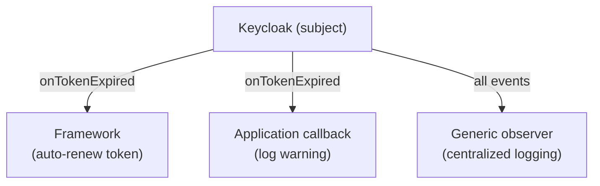

## Definition

The Observer pattern allows a subject to notify subscribers when an event occurs,
without direct coupling. Subscribers react to events according to their own logic.

## Diagram



## Implementation in Granit

| Subject | Events | Package |
|---------|--------|---------|
| `keycloak-js` | `onReady`, `onAuthSuccess`, `onTokenExpired`, etc. | `@granit/react-authentication` |
| `NotificationTransport` | `onNotification`, `onStateChange` | `@granit/notifications` |
| `CookieConsentProvider` | `onConsentChange` | `@granit/cookies` |

### Keycloak dual-callback design

The hook supports two callback types:
- **Specific observers**: `onTokenExpired?`, `onAuthRefreshError?`, `onAuthLogout?`
- **Generic observer**: `onEvent?(event, error?)` — receives all events

The framework executes default behavior first (e.g. `updateToken(60)` on expiry),
then propagates to application callbacks.

## Rationale

Keycloak emits lifecycle events that require both framework-level behavior
(token renewal) and application-level behavior (logging, UI updates). The
Observer pattern lets both coexist without coupling.

## Usage example

```ts
type KeycloakEvent =
  | 'onReady' | 'onAuthSuccess' | 'onAuthError'
  | 'onAuthRefreshSuccess' | 'onAuthRefreshError'
  | 'onAuthLogout' | 'onTokenExpired';

const auth = useKeycloakInit({
  url: import.meta.env.VITE_KEYCLOAK_URL,
  realm: import.meta.env.VITE_KEYCLOAK_REALM,
  clientId: import.meta.env.VITE_KEYCLOAK_CLIENT_ID,

  // Specific observer
  onTokenExpired: () => {
    logger.warn('Token expired — renewing');
  },

  // Generic observer — centralized logging
  onEvent: (event, error) => {
    logger.debug('Keycloak event', { event, error });
  },
});
```

## Further reading

- [Observer — refactoring.guru](https://refactoring.guru/design-patterns/observer)
