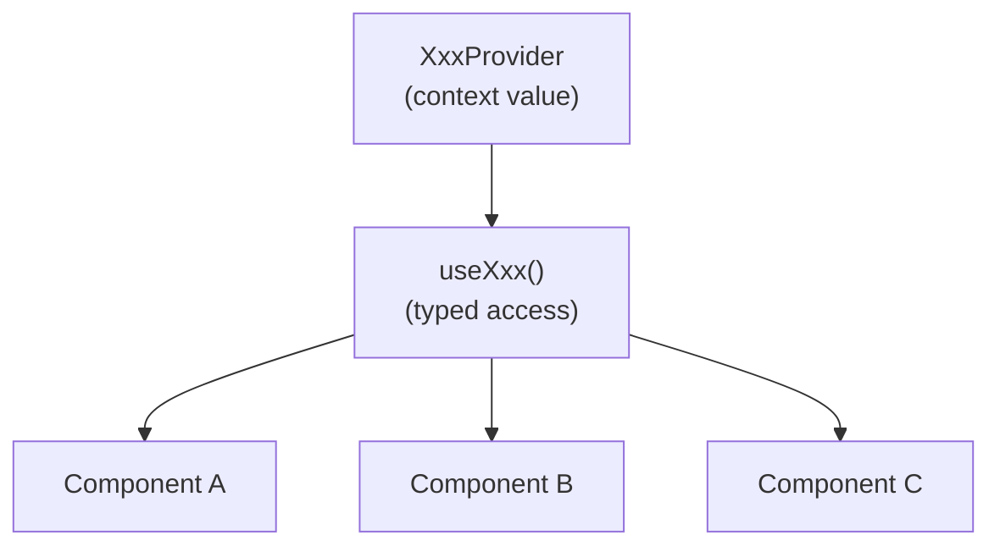

## Definition

The Provider pattern uses React Context to inject shared state into the component
tree. A high-level component provides a value; descendant components access it
via a hook — no prop drilling.

Combined with a generic factory, each application can type its own context.

## Diagram



## Implementation in Granit

Every `@granit/react-*` package follows this pattern:

| Provider | Hook | Package |
|----------|------|---------|
| `WorkflowProvider` | `useWorkflowConfig()` | `@granit/react-workflow` |
| `TimelineProvider` | `useTimelineConfig()` | `@granit/react-timeline` |
| `NotificationProvider` | `useNotificationContext()` | `@granit/react-notifications` |
| `QueryProvider` | `useQueryConfig()` | `@granit/react-query-engine` |
| `SettingsProvider` | `useSettingsConfig()` | `@granit/react-settings` |
| `TemplatingProvider` | `useTemplatingConfig()` | `@granit/templating` |
| `ExportProvider` / `ImportProvider` | context hooks | `@granit/react-data-exchange` |
| `ErrorContextProvider` | `useErrorContext()` | `@granit/react-error-boundary` |
| `CookieConsentProvider` | `useCookieConsent()` | `@granit/react-cookies` |
| `TracingProvider` | `useTracer()` | `@granit/react-tracing` |

### Generic factory for authentication

```ts
// createAuthContext<T>() creates both the context and the hook
export const { AuthContext, useAuth } = createAuthContext<AuthContextType>();
```

Each application defines its own `AuthContextType` extending `BaseAuthContextType`.

## Rationale

React applications need to share configuration (API client, base path) and state
(connection status, current user) across deeply nested components. Context avoids
prop drilling while keeping the dependency explicit — the hook throws if called
outside its Provider.

## Usage example

```tsx
// 1. Define typed context
interface AuthContextType extends BaseAuthContextType {
  register: () => void;
}
export const { AuthContext, useAuth } = createAuthContext<AuthContextType>();

// 2. Provide value at the top of the tree
function AuthProvider({ children }: { children: React.ReactNode }) {
  const value: AuthContextType = { /* ... */ };
  return <AuthContext.Provider value={value}>{children}</AuthContext.Provider>;
}

// 3. Consume anywhere below
function NavBar() {
  const { user, logout } = useAuth();
  return <button onClick={logout}>{user?.name}</button>;
}

// 4. Mock for testing / Storybook
import { createMockProvider } from '@granit/react-authentication';
const MockAuth = createMockProvider(AuthContext, {
  keycloak: null, authenticated: true, loading: false,
  user: { sub: '1', name: 'Test' },
  login: () => {}, logout: () => {}, register: () => {},
});
```

## Further reading

- [React Context — react.dev](https://react.dev/learn/passing-data-deeply-with-context)
