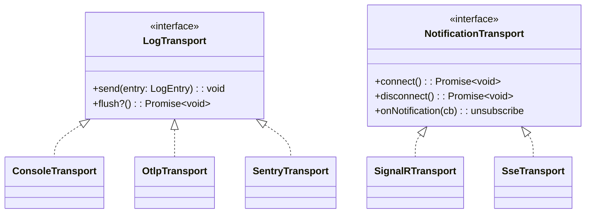

## Definition

The Strategy pattern defines a family of interchangeable algorithms behind a
common interface. The context delegates behavior to a strategy object without
knowing its implementation.

## Diagram



## Implementation in Granit

| Strategy interface | Package | Implementations |
|-------------------|---------|-----------------|
| `LogTransport` | `@granit/logger` | `createConsoleTransport()`, `createOtlpTransport()` |
| `NotificationTransport` | `@granit/notifications` | `createSignalRTransport()`, `createSseTransport()` |
| `CookieConsentProvider` | `@granit/cookies` | `createKlaroCookieConsentProvider()` |

## Rationale

Log destinations and real-time notification channels vary by deployment. The
Strategy pattern lets applications compose the exact set of transports they
need without modifying framework code. A Sentry transport can be added alongside
the console transport without either knowing about the other.

## Usage example

```ts
import { createLogger, createConsoleTransport } from '@granit/logger';
import type { LogTransport, LogEntry } from '@granit/logger';

// Custom Sentry transport
const sentryTransport: LogTransport = {
  send(entry: LogEntry) {
    if (entry.level === 'ERROR') {
      Sentry.captureMessage(entry.message, {
        level: 'error',
        extra: entry.context,
      });
    }
  },
};

// Combine console + Sentry
const logger = createLogger('app', {
  transports: [createConsoleTransport(), sentryTransport],
});

logger.error('Critical failure', new Error('timeout'));
// → Both console and Sentry receive the entry
```

Transports with a `flush()` method are automatically flushed on `beforeunload`.

## Further reading

- [Strategy — refactoring.guru](https://refactoring.guru/design-patterns/strategy)
