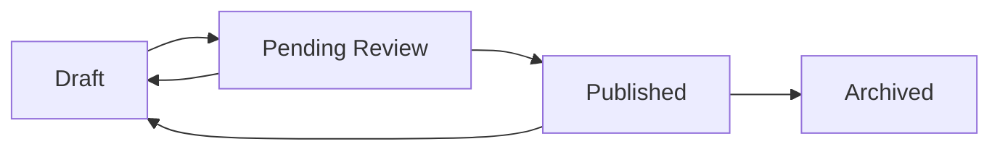

import { Tabs, TabItem, FileTree } from "@astrojs/starlight/components";

`@granit/templating` is a unified package (no TS/React split) that provides template
management — mirroring `Granit.Templating` and `Granit.DocumentGeneration` on the .NET
backend. It covers CRUD operations, Draft→Published→Archived lifecycle, HTML/PDF/Excel
preview rendering, variable discovery, categories, and full revision history.

Built on TanStack Query — all hooks return `UseQueryResult` or `UseMutationResult`
with automatic cache invalidation.

**Peer dependencies:** `axios`, `react ^19`, `@tanstack/react-query ^5`

## Package structure

<FileTree>
- @granit/templating/ Types, API functions, provider, hooks (unified package)
</FileTree>

| Package | Role | Depends on |
|---------|------|------------|
| `@granit/templating` | DTOs, lifecycle enums, API functions, `TemplatingProvider`, query/mutation hooks | `axios`, `@tanstack/react-query`, `react` |

:::note[Unified package]
Unlike other Granit frontend domains, templating ships as a single package — there is
no separate `@granit/react-templating`. The API functions can still be used standalone
without React.
:::

## Setup

<Tabs>
<TabItem label="React (recommended)">

```tsx
import { TemplatingProvider } from '@granit/templating';
import { api } from './api-client';

function App({ children }) {
  return (
    <TemplatingProvider client={api} basePath="/api/v1">
      {children}
    </TemplatingProvider>
  );
}
```

</TabItem>
<TabItem label="TypeScript only">

```ts
import { getTemplates, saveDraft, publishTemplate, previewTemplate } from '@granit/templating';
import type { TemplateDetail, SaveTemplateRequest } from '@granit/templating';
```

</TabItem>
</Tabs>

## Enums

```ts
const TemplateLifecycleStatus = {
  Draft: 0,
  PendingReview: 1,
  Published: 2,
  Archived: 3,
} as const;

type TemplateLifecycleStatusValue =
  (typeof TemplateLifecycleStatus)[keyof typeof TemplateLifecycleStatus];

const DocumentFormat = {
  Html: 0,
  Pdf: 1,
  Excel: 2,
} as const;

type DocumentFormatValue = (typeof DocumentFormat)[keyof typeof DocumentFormat];
```

## Types

### Template identity

```ts
interface TemplateKey {
  readonly name: string;
  readonly culture?: string;
}

interface TemplateListItem {
  readonly name: string;
  readonly culture?: string;
  readonly category?: string;
  readonly status: TemplateLifecycleStatusValue;
  readonly mimeType: string;
  readonly lastModifiedAt: string;
  readonly lastModifiedBy: string;
  readonly hasPublishedVersion: boolean;
}

interface TemplateDetail {
  readonly name: string;
  readonly culture?: string;
  readonly category?: string;
  readonly draft?: TemplateRevision;
  readonly published?: TemplateRevision;
}
```

### Revisions

```ts
interface TemplateRevision {
  readonly revisionId: string;
  readonly content: string;
  readonly mimeType: string;
  readonly status: TemplateLifecycleStatusValue;
  readonly createdAt: string;
  readonly createdBy: string;
  readonly publishedAt?: string;
  readonly publishedBy?: string;
}

type TemplateRevisionSummary = Omit<TemplateRevision, 'content'> & {
  readonly contentLength: number;
};

interface TemplateHistory {
  readonly revisions: readonly TemplateRevisionSummary[];
  readonly totalCount: number;
  readonly page: number;
  readonly pageSize: number;
}
```

### Mutations

```ts
interface SaveTemplateRequest {
  readonly name: string;
  readonly culture?: string;
  readonly content: string;
  readonly mimeType?: string;
  readonly category?: string;
}

interface TemplateListParams {
  readonly page?: number;
  readonly pageSize?: number;
  readonly search?: string;
  readonly status?: TemplateLifecycleStatusValue;
  readonly category?: string;
  readonly culture?: string;
}
```

### Lifecycle

```ts
interface TemplateLifecycleInfo {
  readonly name: string;
  readonly culture?: string;
  readonly currentStatus: TemplateLifecycleStatusValue;
  readonly workflowEnabled: boolean;
  readonly availableTransitions: readonly TemplateLifecycleStatusValue[];
}
```

### Preview

```ts
interface TemplatePreviewRequest {
  readonly culture?: string;
  readonly format?: DocumentFormatValue;
  readonly data?: Record<string, unknown>;
}

interface TemplatePreviewResponse {
  readonly html: string;
  readonly plainText?: string;
  readonly subject?: string;
  readonly revisionId: string;
  readonly renderTimeMs: number;
}

interface TemplateParseError {
  readonly message: string;
  readonly line?: number;
  readonly column?: number;
  readonly snippet?: string;
}
```

### Variables

```ts
interface TemplateVariable {
  readonly name: string;
  readonly type: string;
  readonly description?: string;
  readonly example?: string;
}

interface TemplateVariables {
  readonly globalVariables: readonly TemplateVariable[];
  readonly modelVariables: readonly TemplateVariable[];
  readonly enrichedVariables: readonly TemplateVariable[];
}
```

### Categories

```ts
interface TemplateCategory {
  readonly id: string;
  readonly name: string;
  readonly description?: string;
  readonly icon?: string;
  readonly sortOrder: number;
  readonly templateCount: number;
}

interface CreateTemplateCategoryRequest {
  readonly name: string;
  readonly description?: string;
  readonly icon?: string;
  readonly sortOrder?: number;
}

interface UpdateTemplateCategoryRequest {
  readonly name: string;
  readonly description?: string;
  readonly icon?: string;
  readonly sortOrder: number;
}
```

## API functions

### Template CRUD

| Function | Endpoint | Description |
|----------|----------|-------------|
| `getTemplates(client, basePath, params?)` | `GET /templates` | Paginated template list with filtering |
| `getTemplate(client, basePath, name, culture?)` | `GET /templates/{name}` | Single template detail |
| `saveDraft(client, basePath, request)` | `POST /templates` | Create a new draft |
| `updateDraft(client, basePath, name, request)` | `PUT /templates/{name}` | Update an existing draft |
| `deleteDraft(client, basePath, name, culture?)` | `DELETE /templates/{name}` | Delete a draft |

### Lifecycle

| Function | Endpoint | Description |
|----------|----------|-------------|
| `publishTemplate(client, basePath, name, culture?)` | `POST /templates/{name}/publish` | Publish a template |
| `unpublishTemplate(client, basePath, name, culture?)` | `POST /templates/{name}/unpublish` | Revert to draft |
| `getLifecycleInfo(client, basePath, name, culture?)` | `GET /templates/{name}/lifecycle` | Current status and available transitions |

### History & preview

| Function | Endpoint | Description |
|----------|----------|-------------|
| `getHistory(client, basePath, name, params?)` | `GET /templates/{name}/history` | Paginated revision history |
| `getRevision(client, basePath, name, revisionId)` | `GET /templates/{name}/revisions/{id}` | Specific revision content |
| `previewTemplate(client, basePath, name, request)` | `POST /templates/{name}/preview` | Preview as HTML/text |
| `previewTemplateBinary(client, basePath, name, request)` | `POST /templates/{name}/preview` | Preview as PDF/Excel (Blob) |
| `getVariables(client, basePath, name)` | `GET /templates/{name}/variables` | Available template variables |

### Categories

| Function | Endpoint | Description |
|----------|----------|-------------|
| `getCategories(client, basePath)` | `GET /template-categories` | List all categories |
| `createCategory(client, basePath, request)` | `POST /template-categories` | Create a category |
| `updateCategory(client, basePath, id, request)` | `PUT /template-categories/{id}` | Update a category |
| `deleteCategory(client, basePath, id)` | `DELETE /template-categories/{id}` | Delete a category |

## Provider & hooks

### `TemplatingProvider`

```tsx
interface TemplatingProviderProps {
  client: AxiosInstance;
  basePath?: string;                     // default: '/api/v1'
  queryKeyPrefix?: readonly string[];    // default: ['templates']
  children: React.ReactNode;
}

<TemplatingProvider client={api}>
  {children}
</TemplatingProvider>
```

### Query hooks

#### `useTemplates(params?)`

Paginated template list with filtering.

```ts
function useTemplates(params?: TemplateListParams): UseQueryResult<PaginatedResponse<TemplateListItem>>;
```

#### `useTemplate(name, culture?)`

Single template detail. Auto-disables when `name` is falsy.

```ts
function useTemplate(name: string, culture?: string): UseQueryResult<TemplateDetail>;
```

#### `useTemplateVariables(name)`

Available template variables. Cached 5 minutes.

```ts
function useTemplateVariables(name: string): UseQueryResult<TemplateVariables>;
```

#### `useTemplateHistory(name, params?)`

Paginated revision history.

```ts
function useTemplateHistory(
  name: string,
  params?: { culture?: string; page?: number; pageSize?: number }
): UseQueryResult<TemplateHistory>;
```

#### `useTemplateRevision(name, revisionId)`

Specific revision content. Auto-disables when either param is falsy.

```ts
function useTemplateRevision(name: string, revisionId: string): UseQueryResult<TemplateRevision>;
```

#### `useTemplateCategories()`

All template categories. Cached 5 minutes.

```ts
function useTemplateCategories(): UseQueryResult<TemplateCategory[]>;
```

### Mutation hooks

#### `useTemplateMutations()`

Grouped mutations for template CRUD and lifecycle. Invalidates related queries on success.

```ts
interface UseTemplateMutationsReturn {
  readonly saveDraft: UseMutationResult<TemplateDetail, unknown, SaveTemplateRequest>;
  readonly updateDraft: UseMutationResult<TemplateDetail, unknown, { name: string; request: SaveTemplateRequest }>;
  readonly deleteDraft: UseMutationResult<void, unknown, { name: string; culture?: string }>;
  readonly publish: UseMutationResult<void, unknown, { name: string; culture?: string }>;
  readonly unpublish: UseMutationResult<void, unknown, { name: string; culture?: string }>;
}
```

#### `useTemplatePreview()`

Preview a template as HTML/text.

```ts
function useTemplatePreview(): UseMutationResult<
  TemplatePreviewResponse, unknown, { name: string; request: TemplatePreviewRequest }
>;
```

#### `useTemplateBinaryPreview()`

Preview a template as a binary document (PDF or Excel).

```ts
function useTemplateBinaryPreview(): UseMutationResult<
  Blob, unknown, { name: string; request: TemplatePreviewRequest }
>;
```

#### `useTemplateCategoryMutations()`

Category CRUD with automatic cache invalidation.

```ts
interface UseTemplateCategoryMutationsReturn {
  readonly create: UseMutationResult<TemplateCategory, unknown, CreateTemplateCategoryRequest>;
  readonly update: UseMutationResult<TemplateCategory, unknown, { id: string; request: UpdateTemplateCategoryRequest }>;
  readonly delete: UseMutationResult<void, unknown, string>;
}
```

### Query keys

For advanced cache control, the package exports a `templateKeys` factory:

```ts
const templateKeys = {
  all: (prefix) => [...prefix],
  lists: (prefix) => [...prefix, 'list'],
  list: (prefix, params) => [...prefix, 'list', params],
  details: (prefix) => [...prefix, 'detail'],
  detail: (prefix, name) => [...prefix, 'detail', name],
  history: (prefix, name) => [...prefix, 'history', name],
  revision: (prefix, name, revisionId) => [...prefix, 'revision', name, revisionId],
  variables: (prefix, name) => [...prefix, 'variables', name],
  categories: (prefix) => [...prefix, 'categories'],
} as const;
```

### Template lifecycle



## Public API summary

| Category | Key exports | Package |
|----------|-------------|---------|
| Enums | `TemplateLifecycleStatus`, `DocumentFormat` | `@granit/templating` |
| Template types | `TemplateDetail`, `TemplateListItem`, `TemplateRevision`, `SaveTemplateRequest` | `@granit/templating` |
| Preview types | `TemplatePreviewRequest`, `TemplatePreviewResponse`, `TemplateParseError` | `@granit/templating` |
| Variable types | `TemplateVariable`, `TemplateVariables` | `@granit/templating` |
| Category types | `TemplateCategory`, `CreateTemplateCategoryRequest` | `@granit/templating` |
| API functions | `getTemplates()`, `saveDraft()`, `publishTemplate()`, `previewTemplate()`, `getVariables()` | `@granit/templating` |
| Provider | `TemplatingProvider`, `useTemplatingConfig()` | `@granit/templating` |
| Query hooks | `useTemplates()`, `useTemplate()`, `useTemplateVariables()`, `useTemplateHistory()`, `useTemplateCategories()` | `@granit/templating` |
| Mutation hooks | `useTemplateMutations()`, `useTemplatePreview()`, `useTemplateBinaryPreview()`, `useTemplateCategoryMutations()` | `@granit/templating` |
| Cache keys | `templateKeys` | `@granit/templating` |

## See also

- [Granit.Templating module](/dotnet/business/templating/) — .NET Scriban template engine with EF store
- [Workflow](/frontend/business/workflow/) — Templates use `WorkflowLifecycleStatus` for publication lifecycle
- [Data Exchange](./data-exchange/) — Export templates can be managed through this system
