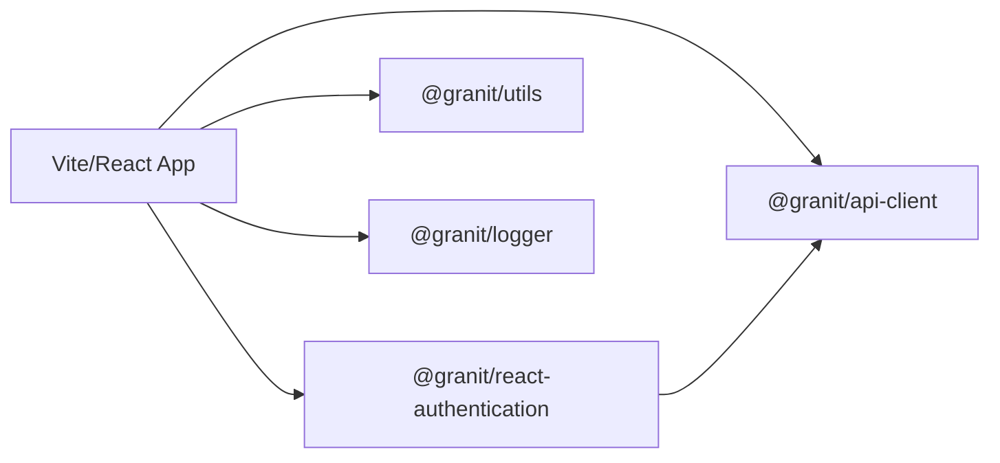

import { Steps, Tabs, TabItem, FileTree } from '@astrojs/starlight/components';

This guide shows how to integrate `granit-front` into an existing Vite/React
application. By the end, the application will have a structured logger, an
authenticated HTTP client, and a typed Keycloak authentication context.

## Target architecture



## Prerequisites

- **Node.js** 24+
- **pnpm** 10+
- A running Keycloak instance (or any OIDC provider)
- Familiarity with TypeScript and React

## Integration steps

<Steps>

1. **Clone the repository**

   Clone `granit-front` next to the consuming application:

   ```text
   workspace/
   ├── granit-front/          ← framework monorepo
   └── my-app/                ← your Vite/React application
   ```

   ```bash
   cd workspace
   git clone <repository-url> granit-front
   cd granit-front && pnpm install
   ```

2. **Declare dependencies**

   In the application's `package.json`, add packages using the `link:` protocol:

   ```json
   {
     "dependencies": {
       "@granit/logger": "link:../granit-front/packages/@granit/logger",
       "@granit/utils": "link:../granit-front/packages/@granit/utils",
       "@granit/api-client": "link:../granit-front/packages/@granit/api-client",
       "@granit/react-authentication": "link:../granit-front/packages/@granit/react-authentication"
     }
   }
   ```

   Then install peer dependencies:

   ```bash
   pnpm add axios clsx tailwind-merge date-fns keycloak-js
   ```

3. **Configure Vite and TypeScript**

   <Tabs>
   <TabItem label="vite.config.ts">
   Add aliases so Vite resolves TypeScript sources directly (source-direct pattern):

   ```typescript
   import path from 'path';
   import { defineConfig } from 'vite';

   const GRANIT = path.resolve(__dirname, '../granit-front/packages/@granit');

   export default defineConfig({
     resolve: {
       alias: {
         '@granit/logger': path.join(GRANIT, 'logger/src/index.ts'),
         '@granit/utils': path.join(GRANIT, 'utils/src/index.ts'),
         '@granit/api-client': path.join(GRANIT, 'api-client/src/index.ts'),
         '@granit/react-authentication': path.join(GRANIT, 'react-authentication/src/index.ts'),
       },
     },
   });
   ```
   </TabItem>
   <TabItem label="tsconfig.json">
   Add matching `paths` in **every** tsconfig (`tsconfig.app.json`, `tsconfig.test.json`,
   `tsconfig.storybook.json`):

   ```json
   {
     "compilerOptions": {
       "paths": {
         "@granit/logger": ["../granit-front/packages/@granit/logger/src/index.ts"],
         "@granit/utils": ["../granit-front/packages/@granit/utils/src/index.ts"],
         "@granit/api-client": ["../granit-front/packages/@granit/api-client/src/index.ts"],
         "@granit/react-authentication": [
           "../granit-front/packages/@granit/react-authentication/src/index.ts"
         ]
       }
     }
   }
   ```
   </TabItem>
   </Tabs>

4. **Create the logger and API client**

   <Tabs>
   <TabItem label="src/lib/logger.ts">
   ```typescript
   import { createLogger } from '@granit/logger';

   export const logger = createLogger('[MyApp]');
   ```
   </TabItem>
   <TabItem label="src/lib/api.ts">
   ```typescript
   import { createApiClient } from '@granit/api-client';

   export const api = createApiClient({
     baseURL: import.meta.env.VITE_API_URL,
     timeout: 15_000,
   });
   ```

   The Bearer token is automatically injected by `@granit/react-authentication`
   once configured in the next step.
   </TabItem>
   </Tabs>

5. **Configure Keycloak authentication**

   Create the authentication context and provider:

   ```typescript
   // src/auth/auth-context.ts
   import { createAuthContext } from '@granit/react-authentication';
   import type { BaseAuthContextType } from '@granit/authentication';

   interface AuthContextType extends BaseAuthContextType {
     // Add application-specific fields if needed
   }

   export const { AuthContext, useAuth } = createAuthContext<AuthContextType>();
   ```

   ```tsx
   // src/auth/AuthProvider.tsx
   import { useKeycloakInit } from '@granit/react-authentication';
   import { AuthContext } from './auth-context';

   export function AuthProvider({ children }: { children: React.ReactNode }) {
     const auth = useKeycloakInit({
       url:      import.meta.env.VITE_KEYCLOAK_URL,
       realm:    import.meta.env.VITE_KEYCLOAK_REALM,
       clientId: import.meta.env.VITE_KEYCLOAK_CLIENT_ID,
     });

     if (auth.loading) return <div>Loading…</div>;

     return (
       <AuthContext.Provider value={auth}>
         {children}
       </AuthContext.Provider>
     );
   }
   ```

   Wrap the application:

   ```tsx
   // src/main.tsx
   import { AuthProvider } from './auth/AuthProvider';
   import { App } from './App';

   createRoot(document.getElementById('root')!).render(
     <AuthProvider>
       <App />
     </AuthProvider>
   );
   ```

</Steps>

## Verify the setup

```bash
# Verify granit-front is healthy
cd ../granit-front
pnpm lint && pnpm tsc && pnpm test run

# Start the application
cd ../my-app
pnpm dev
```

## Usage example

```tsx
import { useAuth } from './auth/auth-context';
import { logger } from '@/lib/logger';

function UserProfile() {
  const { user, logout } = useAuth();

  logger.info('Profile displayed', { userId: user?.sub });

  return (
    <div>
      <p>{user?.name}</p>
      <button onClick={logout}>Sign out</button>
    </div>
  );
}
```

## How source resolution works

```text
import { useQueryEndpoint } from '@granit/query-engine'
  → Vite alias → packages/@granit/query-engine/src/index.ts
  → TypeScript source → transpiled on the fly by Vite
  → no dist/, no intermediate build
```

This **source-direct** approach provides instant HMR on framework code, zero build
watch overhead, direct source maps, and frictionless refactoring across framework
and application boundaries.

## See also

- [Frontend SDK Overview](/frontend/) — package reference
- [Frontend Testing](/frontend/guides/testing/) — test conventions and patterns
- [Frontend Troubleshooting](/frontend/guides/troubleshooting/) — common issues and solutions
