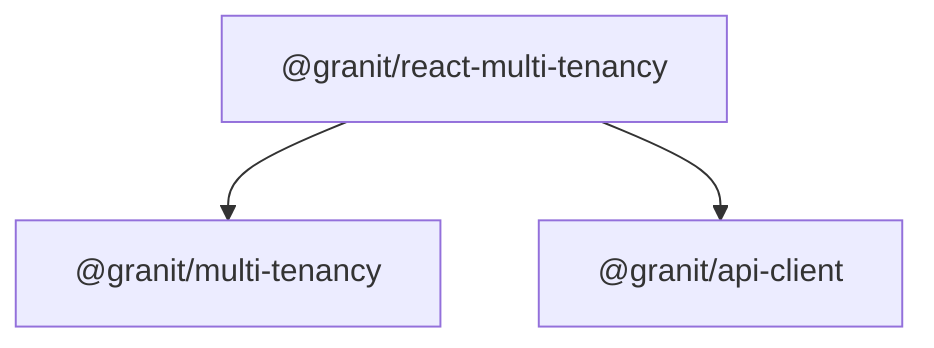
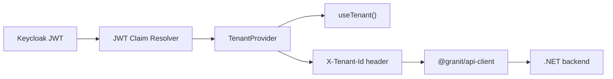

import { Tabs, TabItem, FileTree } from "@astrojs/starlight/components";

`@granit/multi-tenancy` defines a framework-agnostic tenant resolver abstraction — a pipeline
of ordered resolvers that extract the current tenant from JWT claims, URL patterns, or other
sources. `@granit/react-multi-tenancy` provides `TenantProvider` which resolves the tenant,
exposes it via context, and automatically wires the `X-Tenant-Id` header on all HTTP requests
through `@granit/api-client`.

This mirrors the .NET `Granit.MultiTenancy` module: same resolver pipeline pattern, same
claim names, same header convention.

**Peer dependencies:** `react ^19`, `@granit/api-client`

## Package structure

<FileTree>
- @granit/multi-tenancy/ Tenant types, resolver interface, JWT resolver factory (framework-agnostic)
  - @granit/react-multi-tenancy TenantProvider, useTenant hook, Keycloak resolver hook
</FileTree>

| Package | Role | Depends on |
|---------|------|------------|
| `@granit/multi-tenancy` | `TenantInfo`, `CurrentTenant`, `TenantResolver`, `resolveTenant()`, `createJwtClaimTenantResolver()` | — |
| `@granit/react-multi-tenancy` | `TenantProvider`, `useTenant`, `useKeycloakTenantResolvers` | `@granit/multi-tenancy`, `@granit/api-client`, `react` |

## Dependency graph



## Setup

<Tabs>
<TabItem label="React + Keycloak">

```tsx
import { TenantProvider } from '@granit/react-multi-tenancy';
import { useKeycloakTenantResolvers } from '@granit/react-multi-tenancy';
import { useAuth } from './auth-context';

function AppWithTenant({ children }: { children: React.ReactNode }) {
  const { tokenParsed } = useAuth();
  const resolvers = useKeycloakTenantResolvers({ tokenParsed });

  return (
    <TenantProvider resolvers={resolvers}>
      {children}
    </TenantProvider>
  );
}
```

</TabItem>
<TabItem label="TypeScript only">

```ts
import {
  createJwtClaimTenantResolver,
  resolveTenant,
} from '@granit/multi-tenancy';
import type { TenantResolver, TenantInfo } from '@granit/multi-tenancy';

const jwtResolver = createJwtClaimTenantResolver({
  tokenParsedGetter: () => decodedToken,
});

const tenant = resolveTenant([jwtResolver]);
if (tenant) {
  console.log(`Tenant: ${tenant.name} (${tenant.id})`);
}
```

</TabItem>
</Tabs>

## TypeScript SDK

### `TenantInfo`

```ts
interface TenantInfo {
  readonly id: string;
  readonly name?: string;
}
```

### `CurrentTenant`

```ts
interface CurrentTenant {
  readonly isAvailable: boolean;
  readonly tenantId: string | undefined;
  readonly tenantName: string | undefined;
}
```

### `MultiTenancyOptions`

```ts
interface MultiTenancyOptions {
  readonly isEnabled?: boolean;          // default: true
  readonly tenantIdClaimType?: string;   // default: 'tenant_id'
  readonly tenantIdHeaderName?: string;  // default: 'X-Tenant-Id'
}
```

### `DEFAULT_MULTI_TENANCY_OPTIONS`

```ts
const DEFAULT_MULTI_TENANCY_OPTIONS: Required<MultiTenancyOptions> = {
  isEnabled: true,
  tenantIdClaimType: 'tenant_id',
  tenantIdHeaderName: 'X-Tenant-Id',
} as const;
```

### `TenantResolver`

Interface for tenant resolution strategies. Mirrors .NET `ITenantResolver`.

```ts
interface TenantResolver {
  readonly order: number;       // lower = higher priority
  readonly name: string;        // for logging/debugging
  resolve(): TenantInfo | null; // null = unable to resolve
}
```

### `resolveTenant(resolvers)`

Executes resolvers in ascending `order`, returning the first non-null result.
Mirrors the .NET `TenantResolverPipeline`.

```ts
function resolveTenant(resolvers: readonly TenantResolver[]): TenantInfo | null;
```

### `createJwtClaimTenantResolver(options)`

Factory that creates a resolver extracting tenant ID from JWT claims.

```ts
interface JwtClaimTenantResolverOptions {
  readonly tokenParsedGetter: () => Record<string, unknown> | undefined;
  readonly claimType?: string;  // default: 'tenant_id'
}

function createJwtClaimTenantResolver(
  options: JwtClaimTenantResolverOptions
): TenantResolver;
```

Returns a resolver with `order: 200` and `name: "JwtClaimTenantResolver"`.
Extracts `tenant_id` (or custom claim) and optional `tenant_name` from the decoded JWT.
Returns `null` if the token is undefined, the claim is missing, or the claim is empty.

### Resolver priority

| Resolver | Order | Source |
|----------|-------|--------|
| Custom (URL/subdomain) | 100 | Developer-defined |
| JWT claim | 200 | `createJwtClaimTenantResolver()` |

First non-null result wins. The pipeline does not mutate the resolver array.

## React bindings

:::note[Framework-agnostic core]
All types and functions above live in `@granit/multi-tenancy` — pure TypeScript with zero
React or Axios dependency. The React package below wraps them into a provider and hooks.
:::

### `TenantProvider`

Resolves the tenant from the provided resolvers and exposes it via context. Automatically
registers a tenant getter on `@granit/api-client` via `setTenantGetter()`, which adds
the `X-Tenant-Id` header to all HTTP requests.

```tsx
interface TenantProviderProps {
  readonly resolvers: readonly TenantResolver[];
  readonly options?: MultiTenancyOptions;
  readonly children: ReactNode;
}

function TenantProvider(props: TenantProviderProps): JSX.Element;
```

When multi-tenancy is disabled (`options.isEnabled: false`) or no resolver matches,
the provider exposes `{ isAvailable: false, tenantId: undefined, tenantName: undefined }`.

### `useTenant()`

Returns the `CurrentTenant` from the nearest `TenantProvider`.
Throws if called outside the provider.

```ts
function useTenant(): CurrentTenant;
```

```tsx
function TenantBadge() {
  const { tenantId, tenantName, isAvailable } = useTenant();
  if (!isAvailable) return null;
  return <span>{tenantName ?? tenantId}</span>;
}
```

### `useKeycloakTenantResolvers(options)`

Creates a memoized array of tenant resolvers wired to a Keycloak token. Pass the result
directly to `TenantProvider`.

```ts
interface UseKeycloakTenantResolversOptions {
  readonly tokenParsed: Record<string, unknown> | undefined;
  readonly claimType?: string;  // default: 'tenant_id'
}

function useKeycloakTenantResolvers(
  options: UseKeycloakTenantResolversOptions
): readonly TenantResolver[];
```

### How it flows



1. Keycloak authenticates the user and includes `tenant_id` in the JWT
2. `useKeycloakTenantResolvers` creates a resolver wired to `tokenParsed`
3. `TenantProvider` runs the resolver pipeline and exposes the tenant via context
4. `setTenantGetter()` ensures every HTTP request includes `X-Tenant-Id`
5. The .NET backend receives the header and resolves the tenant via `HeaderTenantResolver`

## Public API summary

| Category | Key exports | Package |
|----------|-------------|---------|
| Types | `TenantInfo`, `CurrentTenant`, `MultiTenancyOptions`, `DEFAULT_MULTI_TENANCY_OPTIONS` | `@granit/multi-tenancy` |
| Resolver | `TenantResolver`, `resolveTenant()`, `createJwtClaimTenantResolver()` | `@granit/multi-tenancy` |
| Provider | `TenantProvider`, `TenantProviderProps` | `@granit/react-multi-tenancy` |
| Hooks | `useTenant()`, `useKeycloakTenantResolvers()` | `@granit/react-multi-tenancy` |

## See also

- [Granit.MultiTenancy module](/dotnet/infrastructure/multi-tenancy/) — .NET tenant isolation and resolver pipeline
- [API client](./api-client/) — `setTenantGetter` is wired automatically by `TenantProvider`
- [Authentication](./authentication/) — Keycloak session that provides the JWT with `tenant_id`
