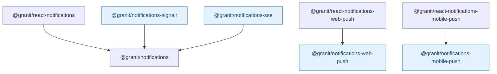

import { Tabs, TabItem, FileTree } from "@astrojs/starlight/components";

`@granit/notifications` provides a transport-agnostic notification system — types, API
functions, and a `NotificationTransport` interface for plugging in real-time channels.
`@granit/react-notifications` wraps this into a provider with hooks for the notification
inbox, unread count, activity feed, and user preferences.

Four transport packages implement the `NotificationTransport` interface: SignalR
(WebSocket + LongPolling), SSE (Server-Sent Events), Web Push (VAPID), and mobile
push (Capacitor).

**Peer dependencies:** `axios`, `react ^19`, `@tanstack/react-query ^5`

## Package structure

<FileTree>
- @granit/notifications/ Types, API functions, transport interface (framework-agnostic)
  - @granit/react-notifications Provider, inbox/feed/preferences hooks
  - @granit/notifications-signalr SignalR transport (WebSocket + LongPolling)
  - @granit/notifications-sse SSE transport (Server-Sent Events)
  - @granit/notifications-web-push/ Web Push VAPID subscription API
    - @granit/react-notifications-web-push useWebPush hook
  - @granit/notifications-mobile-push/ Mobile push token registration API
    - @granit/react-notifications-mobile-push useMobilePush hook (Capacitor)
</FileTree>

| Package | Role | Depends on |
|---------|------|------------|
| `@granit/notifications` | DTOs, API functions, `NotificationTransport` interface | `axios` |
| `@granit/react-notifications` | `NotificationProvider`, inbox/feed/preferences hooks | `@granit/notifications`, `@granit/react-query-engine`, `react` |
| `@granit/notifications-signalr` | `createSignalRTransport()` factory | `@granit/notifications`, `@microsoft/signalr` |
| `@granit/notifications-sse` | `createSseTransport()` factory | `@granit/notifications`, `@microsoft/fetch-event-source` |
| `@granit/notifications-web-push` | `registerPushSubscription()`, VAPID helpers | `axios` |
| `@granit/react-notifications-web-push` | `useWebPush()` hook | `@granit/notifications-web-push`, `react` |
| `@granit/notifications-mobile-push` | `registerDeviceToken()`, `unregisterDeviceToken()` | `axios` |
| `@granit/react-notifications-mobile-push` | `useMobilePush()` hook | `@granit/notifications-mobile-push`, `@capacitor/push-notifications`, `react` |

## Dependency graph



## Setup

<Tabs>
<TabItem label="React + SignalR">

```tsx
import { NotificationProvider } from '@granit/react-notifications';
import { createSignalRTransport } from '@granit/notifications-signalr';
import { api } from './api-client';

const transport = createSignalRTransport({
  hubUrl: '/hubs/notifications',
  tokenGetter: () => keycloak.token,
});

function App() {
  return (
    <NotificationProvider config={{ apiClient: api }} transport={transport}>
      <NotificationBell />
    </NotificationProvider>
  );
}
```

</TabItem>
<TabItem label="React + SSE">

```tsx
import { NotificationProvider } from '@granit/react-notifications';
import { createSseTransport } from '@granit/notifications-sse';

const transport = createSseTransport({
  streamUrl: '/api/v1/notifications/stream',
  tokenGetter: () => keycloak.token,
});

<NotificationProvider config={{ apiClient: api }} transport={transport}>
  {children}
</NotificationProvider>
```

</TabItem>
<TabItem label="TypeScript only">

```ts
import type { NotificationDto, NotificationTransport } from '@granit/notifications';
import { fetchNotifications, markAsRead } from '@granit/notifications';
```

</TabItem>
</Tabs>

## TypeScript SDK

### Types

#### `NotificationSeverity`

```ts
type NotificationSeverity = 'info' | 'success' | 'warning' | 'error';
```

#### `NotificationDto`

```ts
interface NotificationDto {
  id: string;
  title: string;
  body: string | null;
  severity: NotificationSeverity;
  entityType: string | null;
  entityId: string | null;
  isRead: boolean;
  createdAt: string;
  readAt: string | null;
}
```

#### `NotificationPageDto`

```ts
interface NotificationPageDto {
  items: NotificationDto[];
  totalCount: number;
  nextCursor: string | null;
  unreadCount: number;
}
```

#### `ActivityFeedEntryDto`

```ts
interface ActivityFeedEntryDto {
  id: string;
  title: string;
  body: string | null;
  severity: NotificationSeverity;
  createdAt: string;
  userId: string | null;
  userDisplayName: string | null;
}
```

#### `NotificationChannels`

```ts
const NotificationChannels = {
  InApp: 'inApp',
  Email: 'email',
  Sms: 'sms',
  WhatsApp: 'whatsApp',
  Push: 'push',
  MobilePush: 'mobilePush',
  Sse: 'sse',
  SignalR: 'signalR',
  Zulip: 'zulip',
} as const;
```

#### `NotificationPreferenceDto`

```ts
interface NotificationPreferenceDto {
  notificationType: string;
  label: string;
  channels: Record<string, boolean>;
}
```

#### `ConnectionState`

```ts
type ConnectionState = 'disconnected' | 'connecting' | 'connected' | 'reconnecting';
```

### Transport interface

```ts
interface NotificationTransport {
  connect(): Promise<void>;
  disconnect(): Promise<void>;
  readonly state: ConnectionState;
  onNotification(callback: (notification: NotificationDto) => void): () => void;
  onStateChange(callback: (state: ConnectionState) => void): () => void;
}
```

Any transport implementing this interface can be plugged into `NotificationProvider`.

### API functions

| Function | Endpoint | Description |
|----------|----------|-------------|
| `fetchNotifications(client, basePath, params?)` | `GET /notifications` | Paginated inbox |
| `markAsRead(client, basePath, id)` | `PATCH /notifications/{id}/read` | Mark single as read |
| `markAllAsRead(client, basePath)` | `POST /notifications/read-all` | Mark all as read |
| `fetchUnreadCount(client, basePath)` | `GET /notifications/unread-count` | Unread count |
| `fetchEntityActivityFeed(client, basePath, entityType, entityId, params?)` | `GET /activity-feed/{type}/{id}` | Entity activity feed |
| `fetchPreferences(client, basePath)` | `GET /notification-preferences` | User preference matrix |
| `updatePreference(client, basePath, preference)` | `PUT /notification-preferences/{type}` | Update preference |

## Transport implementations

### SignalR

```ts
interface SignalRTransportConfig {
  readonly hubUrl: string;
  readonly tokenGetter?: () => Promise<string | null>;
}

function createSignalRTransport(config: SignalRTransportConfig): NotificationTransport;
```

WebSocket (priority) with LongPolling fallback. Listens to the `ReceiveNotification` hub
event. Auto-reconnects with token refresh on each reconnection.

### SSE (Server-Sent Events)

```ts
interface SseTransportConfig {
  readonly streamUrl: string;
  readonly tokenGetter?: () => Promise<string | null>;
  readonly heartbeatTypeName?: string;  // default: '__heartbeat__'
}

function createSseTransport(config: SseTransportConfig): NotificationTransport;
```

Uses `@microsoft/fetch-event-source` for auto-reconnection. Heartbeat events are
filtered automatically. Connection persists in background tabs (`openWhenHidden: true`).

## React bindings

:::note[Framework-agnostic core]
All types, API functions, and the `NotificationTransport` interface live in
`@granit/notifications` — pure TypeScript. The React packages below wrap them into
a provider and hooks.
:::

### `NotificationProvider`

```tsx
interface NotificationProviderProps {
  children: React.ReactNode;
  config: NotificationConfig;
  transport?: NotificationTransport;
}

function NotificationProvider(props: NotificationProviderProps): JSX.Element;
```

### `useNotificationContext()`

Returns connection state, last received notification, and unread count from the provider.

### `useNotifications(options?)`

Paginated inbox with mark-as-read support and infinite scroll via `@granit/react-query-engine`.

```ts
interface UseNotificationsReturn {
  notifications: readonly NotificationDto[];
  totalCount: number;
  loading: boolean;
  loadingMore: boolean;
  hasMore: boolean;
  loadMore: () => void;
  refresh: () => void;
  markRead: (id: string) => Promise<void>;
  markAllRead: () => Promise<void>;
}
```

### `useUnreadCount(options?)`

Unread badge count with configurable polling interval (default: 60 seconds).

```ts
interface UseUnreadCountReturn {
  count: number;
  refresh: () => void;
}
```

### `useEntityActivityFeed(options)`

Activity feed scoped to a specific entity (e.g. all actions on an invoice).

```ts
interface UseEntityActivityFeedReturn {
  entries: readonly ActivityFeedEntryDto[];
  totalCount: number;
  loading: boolean;
  hasMore: boolean;
  loadMore: () => void;
  refresh: () => void;
}
```

### `useNotificationPreferences()`

User notification preference matrix (type × channel) with toggle support.

```ts
interface UseNotificationPreferencesReturn {
  preferences: NotificationPreferenceDto[];
  loading: boolean;
  saving: boolean;
  toggleChannel: (notificationType: string, channel: string, enabled: boolean) => Promise<void>;
  refresh: () => void;
}
```

## Web Push

### TypeScript SDK

```ts
// Register a Web Push subscription with the backend
async function registerPushSubscription(
  client: AxiosInstance, basePath: string, subscription: PushSubscriptionJSON
): Promise<void>;

// Unregister a subscription
async function unregisterPushSubscription(
  client: AxiosInstance, basePath: string, endpoint: string
): Promise<void>;

// Convert URL-safe Base64 VAPID key to Uint8Array for pushManager.subscribe()
function urlBase64ToUint8Array(base64String: string): Uint8Array;
```

### React hook

```ts
interface WebPushConfig {
  readonly vapidPublicKey: string;
  readonly apiClient: AxiosInstance;
  readonly basePath?: string;
  readonly serviceWorkerPath?: string;  // default: '/sw.js'
}

interface UseWebPushReturn {
  readonly isSupported: boolean;
  readonly permission: NotificationPermission;
  readonly isSubscribed: boolean;
  readonly loading: boolean;
  subscribe: () => Promise<void>;
  unsubscribe: () => Promise<void>;
}

function useWebPush(config: WebPushConfig): UseWebPushReturn;
```

## Mobile Push

### TypeScript SDK

```ts
type MobilePlatform = 'android' | 'ios';

interface DeviceTokenDto {
  readonly token: string;
  readonly platform: MobilePlatform;
  readonly deviceId?: string;
}

async function registerDeviceToken(client, basePath, payload: DeviceTokenDto): Promise<void>;
async function unregisterDeviceToken(client, basePath, token: string): Promise<void>;
```

### React hook

```ts
interface UseMobilePushReturn {
  readonly isRegistered: boolean;
  readonly loading: boolean;
  register: () => Promise<void>;
  unregister: () => Promise<void>;
}

function useMobilePush(config: MobilePushConfig): UseMobilePushReturn;
```

Requires `@capacitor/push-notifications`. Handles automatic token refresh — unregisters
the old token and registers the new one on device-side token rotation.

:::caution[Push payloads]
All push channels (Web + Mobile) send wake-up payloads only — no PII in the push payload
body. The notification content is fetched via the API after the device wakes up (ISO 27001
compliant).
:::

## Public API summary

| Category | Key exports | Package |
|----------|-------------|---------|
| Core types | `NotificationDto`, `NotificationSeverity`, `ConnectionState`, `NotificationChannels` | `@granit/notifications` |
| Transport | `NotificationTransport`, `NotificationConfig` | `@granit/notifications` |
| API functions | `fetchNotifications()`, `markAsRead()`, `markAllAsRead()`, `fetchUnreadCount()` | `@granit/notifications` |
| Activity feed | `fetchEntityActivityFeed()`, `ActivityFeedEntryDto` | `@granit/notifications` |
| Preferences | `fetchPreferences()`, `updatePreference()`, `NotificationPreferenceDto` | `@granit/notifications` |
| SignalR | `createSignalRTransport()` | `@granit/notifications-signalr` |
| SSE | `createSseTransport()` | `@granit/notifications-sse` |
| Provider | `NotificationProvider`, `useNotificationContext()` | `@granit/react-notifications` |
| Inbox hooks | `useNotifications()`, `useUnreadCount()` | `@granit/react-notifications` |
| Feed hooks | `useEntityActivityFeed()`, `useNotificationPreferences()` | `@granit/react-notifications` |
| Web Push | `useWebPush()`, `registerPushSubscription()`, `urlBase64ToUint8Array()` | `@granit/react-notifications-web-push`, `@granit/notifications-web-push` |
| Mobile Push | `useMobilePush()`, `registerDeviceToken()` | `@granit/react-notifications-mobile-push`, `@granit/notifications-mobile-push` |

## See also

- [Granit.Notifications module](/dotnet/infrastructure/notifications/) — .NET notification engine (fan-out, delivery tracking, 6 channels)
- [QueryEngine](./query-engine/) — Pagination primitives used by the notification inbox
