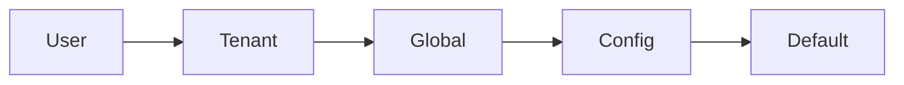

import { Tabs, TabItem, FileTree } from "@astrojs/starlight/components";

`@granit/settings` provides framework-agnostic types and API functions for application
settings — mirroring `Granit.Settings` on the .NET backend. Settings follow a cascade:
User → Tenant → Global → Config → Default. Deleting a user-level setting makes the
tenant or global value take over.

`@granit/react-settings` wraps these into a provider and TanStack Query hooks with
automatic cache invalidation on mutations.

**Peer dependencies:** `axios`, `react ^19`, `@tanstack/react-query ^5`

## Package structure

<FileTree>
- @granit/settings/ Setting types, scope enum, API functions, well-known names (framework-agnostic)
  - @granit/react-settings SettingsProvider, query/mutation hooks
</FileTree>

| Package | Role | Depends on |
|---------|------|------------|
| `@granit/settings` | DTOs, `SettingScope`, API functions, `SETTING_NAMES` | `axios` |
| `@granit/react-settings` | `SettingsProvider`, `useSetting`, `useSettings`, `useUpdateSetting`, `useDeleteSetting` | `@granit/settings`, `@tanstack/react-query`, `react` |

## Setup

<Tabs>
<TabItem label="React (recommended)">

```tsx
import { SettingsProvider } from '@granit/react-settings';
import { api } from './api-client';

function App({ children }) {
  return (
    <SettingsProvider config={{ client: api }}>
      {children}
    </SettingsProvider>
  );
}
```

</TabItem>
<TabItem label="TypeScript only">

```ts
import { fetchSettings, updateSetting, deleteSetting } from '@granit/settings';
import type { SettingsMap, SettingScope } from '@granit/settings';
```

</TabItem>
</Tabs>

## TypeScript SDK

### Types

```ts
type SettingScope = 'user' | 'global' | 'tenant';

interface SettingValueResponse {
  name: string;
  value: string | null;
}

type SettingsMap = Record<string, string | null>;

interface UpdateSettingValueRequest {
  value: string | null;
}
```

### Constants

```ts
const SETTING_NAMES = {
  PREFERRED_CULTURE: 'Granit.Localization.PreferredCulture',
  PREFERRED_TIMEZONE: 'Granit.Timing.PreferredTimezone',
} as const;
```

### API functions

| Function | Endpoint | Description |
|----------|----------|-------------|
| `fetchSettings(client, basePath, scope)` | `GET /settings/{scope}` | All visible settings for a scope |
| `fetchSetting(client, basePath, scope, name)` | `GET /settings/{scope}/{name}` | Single setting by name |
| `updateSetting(client, basePath, scope, name, request)` | `PUT /settings/{scope}/{name}` | Create or update a setting |
| `deleteSetting(client, basePath, scope, name)` | `DELETE /settings/{scope}/{name}` | Delete (reset) — cascade takes over |

## React bindings

:::note[Framework-agnostic core]
All types, constants, and API functions live in `@granit/settings` — pure TypeScript.
The React package below wraps them into a provider and hooks.
:::

### `SettingsProvider`

```tsx
interface SettingsProviderProps {
  readonly config: {
    readonly client: AxiosInstance;
    readonly basePath?: string;
    readonly queryKeyPrefix?: readonly string[];
  };
  readonly children: ReactNode;
}

<SettingsProvider config={{ client: api }}>
  {children}
</SettingsProvider>
```

### `useSettings(scope, options?)`

Fetches all visible settings for a scope.

```ts
function useSettings(
  scope: SettingScope,
  options?: { enabled?: boolean }
): UseQueryResult<SettingsMap>;
```

### `useSetting(scope, name, options?)`

Fetches a single setting by name.

```ts
function useSetting(
  scope: SettingScope,
  name: string,
  options?: { enabled?: boolean }
): UseQueryResult<SettingValueResponse>;
```

### `useUpdateSetting(scope)`

Creates or updates a setting value. Invalidates scope and individual setting queries on success.

```ts
interface UseUpdateSettingReturn {
  readonly update: (name: string, value: string | null) => void;
  readonly updateAsync: (name: string, value: string | null) => Promise<void>;
  readonly isPending: boolean;
  readonly error: Error | null;
}
```

### `useDeleteSetting(scope)`

Deletes a setting so the cascade takes over. Invalidates queries on success.

```ts
interface UseDeleteSettingReturn {
  readonly remove: (name: string) => void;
  readonly removeAsync: (name: string) => Promise<void>;
  readonly isPending: boolean;
  readonly error: Error | null;
}
```

### Setting cascade



When a setting is read, the first non-null value in the cascade wins. Deleting a
user-level override makes the tenant or global value visible again.

## Public API summary

| Category | Key exports | Package |
|----------|-------------|---------|
| Types | `SettingScope`, `SettingValueResponse`, `SettingsMap`, `UpdateSettingValueRequest` | `@granit/settings` |
| Constants | `SETTING_NAMES` | `@granit/settings` |
| API functions | `fetchSettings()`, `fetchSetting()`, `updateSetting()`, `deleteSetting()` | `@granit/settings` |
| Provider | `SettingsProvider`, `useSettingsConfig()`, `buildSettingsQueryKey()` | `@granit/react-settings` |
| Query hooks | `useSettings()`, `useSetting()` | `@granit/react-settings` |
| Mutation hooks | `useUpdateSetting()`, `useDeleteSetting()` | `@granit/react-settings` |

## See also

- [Granit.Settings module](/dotnet/infrastructure/application-settings/) — .NET cascaded settings with EF Core store
- [Localization](/frontend/infrastructure/localization/) — `SETTING_NAMES.PREFERRED_CULTURE` stores the user's preferred language
