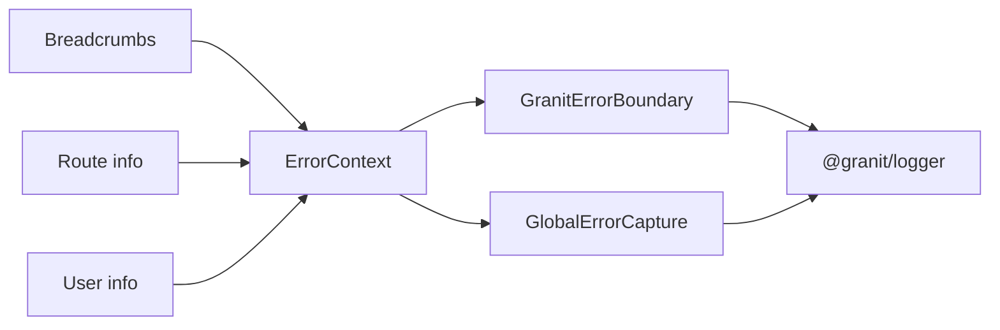

import { Tabs, TabItem, FileTree } from "@astrojs/starlight/components";

`@granit/error-boundary` provides framework-agnostic types for error context enrichment
— breadcrumb trails, route info, and user identity.
`@granit/react-error-boundary` wraps these into a headless React error boundary,
a global error capture component, and a breadcrumb context provider.

All error reporting is delegated to `@granit/logger` — there is no built-in error UI.
The consumer app provides its own fallback via `renderFallback`.

**Peer dependencies:** `@granit/logger`, `react ^19`

## Package structure

<FileTree>
- @granit/error-boundary/ Breadcrumb, ErrorContextConfig types (framework-agnostic)
  - @granit/react-error-boundary GranitErrorBoundary, GlobalErrorCapture, ErrorContextProvider, hooks
</FileTree>

| Package | Role | Depends on |
|---------|------|------------|
| `@granit/error-boundary` | `Breadcrumb`, `ErrorContextConfig`, `ErrorContextValue` | — |
| `@granit/react-error-boundary` | `GranitErrorBoundary`, `GlobalErrorCapture`, `ErrorContextProvider`, `useBreadcrumb` | `@granit/error-boundary`, `@granit/logger`, `react` |

## Setup

<Tabs>
<TabItem label="React (recommended)">

```tsx
import { GranitErrorBoundary, GlobalErrorCapture, ErrorContextProvider } from '@granit/react-error-boundary';
import { createLogger } from '@granit/logger';

const logger = createLogger('app');

function App({ children }) {
  return (
    <ErrorContextProvider config={{
      getRouteInfo: () => window.location.pathname,
      getUserInfo: () => ({ id: currentUser.id }),
      maxBreadcrumbs: 20,
    }}>
      <GlobalErrorCapture logger={logger} />
      <GranitErrorBoundary
        logger={logger}
        renderFallback={(error, reset) => (
          <div>
            <h1>Something went wrong</h1>
            <button onClick={reset}>Retry</button>
          </div>
        )}
      >
        {children}
      </GranitErrorBoundary>
    </ErrorContextProvider>
  );
}
```

</TabItem>
<TabItem label="TypeScript only">

```ts
import type { Breadcrumb, ErrorContextConfig, ErrorContextValue } from '@granit/error-boundary';
```

</TabItem>
</Tabs>

## TypeScript SDK

### Types

```ts
interface Breadcrumb {
  category: string;     // e.g. "navigation", "user", "api"
  message: string;
  timestamp: string;    // ISO 8601
}

interface ErrorContextConfig {
  getRouteInfo?: () => string;
  getUserInfo?: () => { id: string };
  maxBreadcrumbs?: number;    // default: 20 (FIFO circular buffer)
}

interface ErrorContextValue {
  readonly breadcrumbs: readonly Breadcrumb[];
  addBreadcrumb: (category: string, message: string) => void;
  getRouteInfo: () => string | undefined;
  getUserInfo: () => { id: string } | undefined;
}
```

## React bindings

:::note[Framework-agnostic core]
All types live in `@granit/error-boundary` — pure TypeScript.
The React package below provides components and hooks.
:::

### `ErrorContextProvider`

Provides contextual information (route, user, breadcrumbs) that is automatically
attached to errors caught by `GranitErrorBoundary` and `GlobalErrorCapture`.

```tsx
<ErrorContextProvider config={{
  getRouteInfo: () => window.location.pathname,
  getUserInfo: () => ({ id: user.id }),
  maxBreadcrumbs: 20,
}}>
  {children}
</ErrorContextProvider>
```

### `GranitErrorBoundary`

Headless React error boundary. Catches rendering errors, logs them via `@granit/logger`,
and delegates UI to the `renderFallback` function.

```ts
interface ErrorBoundaryProps {
  logger: Logger;
  renderFallback: (error: Error, resetErrorBoundary: () => void) => React.ReactNode;
  onError?: (error: Error, errorInfo: React.ErrorInfo) => void;
  children: React.ReactNode;
}
```

### `GlobalErrorCapture`

Invisible component that listens to `window.onerror` and `window.onunhandledrejection`.
Deduplicates errors by message within a 1-second window. Logs via `@granit/logger`.

```ts
interface GlobalErrorCaptureProps {
  logger: Logger;
  onError?: (error: Error) => void;
}

function GlobalErrorCapture(props: GlobalErrorCaptureProps): null;
```

### `useErrorContext()`

Returns the error context value from the nearest `ErrorContextProvider`.

```ts
function useErrorContext(): ErrorContextValue;
```

### `useBreadcrumb()`

Convenience hook for adding breadcrumbs to the error context.

```ts
function useBreadcrumb(): {
  addBreadcrumb: (category: string, message: string) => void;
};
```

### Error enrichment flow



When an error is caught, the error context (breadcrumbs, route, user) is attached
to the log entry for debugging.

## Public API summary

| Category | Key exports | Package |
|----------|-------------|---------|
| Types | `Breadcrumb`, `ErrorContextConfig`, `ErrorContextValue` | `@granit/error-boundary` |
| Error boundary | `GranitErrorBoundary` | `@granit/react-error-boundary` |
| Global capture | `GlobalErrorCapture` | `@granit/react-error-boundary` |
| Context provider | `ErrorContextProvider`, `useErrorContext()` | `@granit/react-error-boundary` |
| Breadcrumb hook | `useBreadcrumb()` | `@granit/react-error-boundary` |

## See also

- [Logger](./logger/) — Error boundary logs via `@granit/logger`
- [Tracing](./tracing/) — Errors are correlated with traces when `TracingProvider` is active
