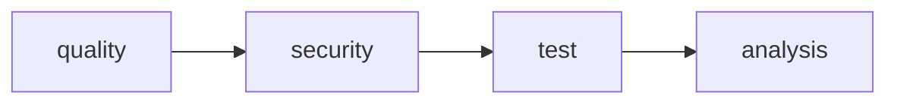

## Pipeline overview

The granit-front pipeline runs on pull requests, `develop`, `main`, and
semantic tags (`v*.*.*`).



| Stage | Jobs | Description |
| --- | --- | --- |
| **quality** | `lint`, `typecheck` | ESLint (0 warnings) + TypeScript strict |
| **security** | `gitleaks`, `codeql`, `trivy` | Secret scanning, SAST, vulnerability scanning |
| **test** | `test` | Vitest with v8 coverage |
| **analysis** | `audit:npm`, `sonarqube` | Dependency audit + SonarQube |

### Runtime environment

| Parameter | Value |
| --- | --- |
| Image | `node:24-bookworm-slim` |
| Package manager | pnpm 10 (via corepack) |
| Cache | `.pnpm-store/` (key: `pnpm-lock.yaml`) |
| Husky hooks | Disabled in CI (`HUSKY=0`) |

## Quality jobs

### Lint

```bash
pnpm lint
```

ESLint with `--max-warnings 0`. Zero warnings tolerated.

Notable rules:

- `no-console` as error (except in `@granit/logger`)
- `@typescript-eslint/consistent-type-imports` — `import type` required
- `import/order` — imports sorted by group

### Typecheck

```bash
pnpm tsc   # pnpm -r exec -- tsc --noEmit
```

TypeScript strict on all packages: no implicit `any`, no unused variables,
no unused parameters.

## Security jobs

**Secret detection** — Gitleaks via GitHub Actions. A detected secret
**blocks the pipeline** (`continue-on-error: false`).

**SAST** — Static analysis via CodeQL. CodeQL is **blocking**
(`continue-on-error: false`).

**Vulnerability scanning** — Trivy scans for known vulnerabilities.
Trivy is **blocking** (`continue-on-error: false`).

## Test job

```bash
pnpm test:coverage
```

Vitest single-run with coverage. Generated artifacts:

| Artifact | Retention | Usage |
| --- | --- | --- |
| `coverage/cobertura-coverage.xml` | 1 week | PR coverage widget |
| `coverage/` (HTML + lcov) | 1 week | Local browsing + SonarQube |

## Analysis jobs

### npm audit

```bash
pnpm audit --audit-level moderate
```

Checks known vulnerabilities in dependencies (moderate and above).
`continue-on-error: true` — informational, does not block the pipeline.

### SonarQube

Conditional — runs only when `SONAR_HOST_URL` and `SONAR_TOKEN` are set.

- **Sources**: `packages/`
- **Coverage**: `coverage/lcov.info`
- **Exclusions**: `**/*.test.ts`, `**/*.test.tsx`, `**/*.d.ts`
- `continue-on-error: true`

## Branch workflow

```mermaid
gitgraph
    commit id: "main"
    branch develop
    commit id: "feat: logger"
    branch feature/auth
    commit id: "feat: auth init"
    commit id: "feat: auth context"
    checkout develop
    merge feature/auth
    branch release/1.0
    commit id: "chore: version"
    checkout main
    merge release/1.0 tag: "v1.0.0"
    checkout develop
    merge release/1.0
```

| Branch | Role |
| --- | --- |
| `main` | Production — direct push forbidden |
| `develop` | Continuous integration |
| `feature/*` | Feature development |
| `release/*` | Release preparation |
| `hotfix/*` | Urgent fixes |

## Pre-commit hooks

Local Git hooks (via Husky) run automatically:

| Hook | Command |
| --- | --- |
| `pre-commit` | `pnpm lint && pnpm tsc` |
| `commit-msg` | `pnpm exec commitlint --edit` |

Commit messages follow [Conventional Commits](https://www.conventionalcommits.org/):
`feat:`, `fix:`, `docs:`, `chore:`, `refactor:`, `test:`.

## Release process

Releases follow semantic versioning (`vMAJOR.MINOR.PATCH`):

1. Create a `release/X.Y` branch from `develop`
2. Verify the pipeline passes (lint + tsc + tests + security)
3. Merge into `main` via PR (1 approval minimum)
4. Tag on `main`: `vX.Y.Z`
5. Merge `main` back into `develop`

## See also

- [Frontend npm Registry](/frontend/operations/npm-registry/) — package publication
- [Frontend Testing](/frontend/guides/testing/) — test conventions
- [Backend CI/CD](/dotnet/operations/ci-cd/) — .NET pipeline
