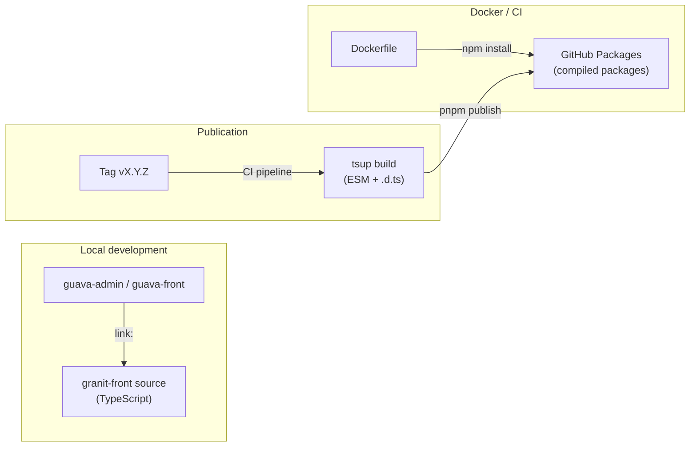

## Overview

The `@granit/*` packages are published on the **GitHub Packages npm registry**.
A hybrid strategy keeps local development performant (hot-reload) while
supporting Docker builds and standalone CI/CD.



## Hybrid strategy

| Context | Resolution | Source | Hot-reload |
| --- | --- | --- | --- |
| Local development | `link:` + Vite aliases | TypeScript source | Yes |
| Docker / CI | GitHub Packages npm registry | Compiled JavaScript + `.d.ts` | No |

### Local development

Applications use `link:` in `package.json` to point to TypeScript sources:

```json
{
  "dependencies": {
    "@granit/logger": "link:../../../granit-front/packages/@granit/logger"
  }
}
```

Combined with Vite aliases, this provides instant hot-reload when modifying
framework code.

### Docker / CI

In Docker, the `granit-front` directory does not exist. The Dockerfile:

1. Copies `.npmrc` (scope `@granit` → GitHub Packages registry)
2. Replaces `link:` dependencies with `*` (registry resolution)
3. Injects the authentication token via `--build-arg NPM_TOKEN`
4. Installs compiled packages from the registry

## Publication

### Versioning

All packages share the same version, aligned with Git tags on the
granit-front project. Semantic versioning (`vMAJOR.MINOR.PATCH`).

### Automatic publication (CI)

Publication is triggered by a **Git tag** matching `vX.Y.Z`:

```bash
git tag v0.1.0
git push origin v0.1.0
```

The CI pipeline runs:

1. `quality` — lint + typecheck
2. `test` — unit tests
3. `build` — `tsup` (ESM + `.d.ts`) for each package
4. `publish` — `pnpm -r publish` to the GitHub Packages registry

Authentication uses `GITHUB_TOKEN` (automatic, no secret to configure).

### Manual publication

For manual publication (not recommended in production):

```bash
# Create a personal access token (PAT) in GitHub > Settings > Personal access tokens
# Scope: write:packages

pnpm build
pnpm -r publish --no-git-checks --access restricted
```

## Consumer configuration

### `.npmrc`

Each consuming application needs an `.npmrc`:

```ini
@granit:registry=https://npm.pkg.github.com
```

### Conditional Vite aliases

The `@granit/*` aliases in `vite.config.ts` are **conditional** — they only
apply when the local `granit-front` directory exists:

```typescript
import fs from 'fs';

const GRANIT = path.resolve(__dirname, '../../../granit-front/packages/@granit');
const useLocalGranit = fs.existsSync(GRANIT);

// Local dev: aliases → TypeScript source (hot-reload)
// Docker/CI: no aliases → resolved via node_modules (registry)
```

### Docker build

```bash
docker build \
  --build-arg NPM_TOKEN=<pat-or-github-token> \
  -t guava-admin .
```

In CI, `GITHUB_TOKEN` is used automatically.

## Package build configuration

### tsup

Each package is compiled with **tsup**:

- **Format**: ESM only
- **Output**: `dist/index.js` + `dist/index.d.ts`
- **Externals**: `@granit/*` (inter-packages), `peerDependencies`

### publishConfig

The `package.json` of each package uses `publishConfig` to separate local
exports (source) from published exports (compiled):

```json
{
  "exports": {
    ".": "./src/index.ts"
  },
  "publishConfig": {
    "exports": {
      ".": {
        "types": "./dist/index.d.ts",
        "import": "./dist/index.js"
      }
    },
    "registry": "https://npm.pkg.github.com"
  }
}
```

- **Locally**: `exports` points to TypeScript source
- **Published**: `publishConfig.exports` overrides and points to `dist/`

## Troubleshooting

### Package not found on the registry

```bash
npm view @granit/logger \
  --registry=https://npm.pkg.github.com
```

Or check in GitHub: **granit-fx/granit-front > Packages**.

### Authentication error (401/403)

- Verify `.npmrc` contains the correct `_authToken`
- In CI: `GITHUB_TOKEN` is automatic, no configuration needed
- Locally: use a personal access token (PAT) with `read:packages` scope

### Docker build fails on @granit/* packages

1. Verify `--build-arg NPM_TOKEN=xxx` is passed to `docker build`
2. Verify packages are published on the registry
3. Verify `.npmrc` is copied in the `deps` stage (not excluded by `.dockerignore`)

## See also

- [Frontend CI/CD](/frontend/operations/ci-cd/) — pipeline and release workflow
- [Frontend Quick Start](/frontend/getting-started/quick-start/) — local setup
