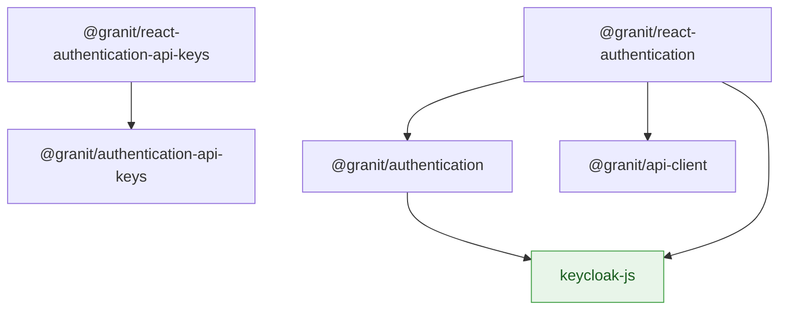

import { Tabs, TabItem, FileTree } from "@astrojs/starlight/components";

`@granit/authentication` defines framework-agnostic Keycloak/OIDC types — user claims,
login/logout options, lifecycle events, and a base auth context interface. `@granit/react-authentication`
provides the `useKeycloakInit` hook that handles PKCE initialization, silent SSO, automatic
token refresh, and back-channel logout. It also exports `createAuthContext` and `createMockProvider`
factories so each consuming app can define its own typed auth context.

`@granit/authentication-api-keys` and `@granit/react-authentication-api-keys` add API key
management — types and React Query hooks for creating, revoking, rotating, and scoping keys.

**Peer dependencies:** `keycloak-js`, `react ^19`, `axios`, `@tanstack/react-query ^5`

## Package structure

<FileTree>
- @granit/authentication/ Keycloak/OIDC types (framework-agnostic)
  - @granit/react-authentication Keycloak init hook, auth context factory, mock provider
- @granit/authentication-api-keys/ API key management types
  - @granit/react-authentication-api-keys React Query hooks for API key CRUD
</FileTree>

| Package | Role | Depends on |
|---------|------|------------|
| `@granit/authentication` | Keycloak types, login/logout options, lifecycle events | `keycloak-js` |
| `@granit/react-authentication` | `useKeycloakInit`, `createAuthContext`, `createMockProvider` | `@granit/authentication`, `@granit/api-client`, `react`, `keycloak-js` |
| `@granit/authentication-api-keys` | API key DTOs (`ApiKeyResponse`, `ApiKeyCreateRequest`, etc.) | — |
| `@granit/react-authentication-api-keys` | `useApiKeys`, `useCreateApiKey`, `useRevokeApiKey`, `useRotateApiKey` | `@granit/authentication-api-keys`, `@tanstack/react-query`, `axios` |

## Dependency graph



## Setup

<Tabs>
<TabItem label="React (recommended)">

```tsx
// src/auth/auth-context.ts
import type { BaseAuthContextType, KeycloakUserInfo } from '@granit/authentication';
import { createAuthContext } from '@granit/react-authentication';

interface AuthContextType extends BaseAuthContextType {
  register: (options?: { redirectUri?: string }) => void;
}

export const { AuthContext, useAuth } = createAuthContext<AuthContextType>();
```

```tsx
// src/auth/AuthProvider.tsx
import { useKeycloakInit } from '@granit/react-authentication';
import { AuthContext } from './auth-context';

export function AuthProvider({ children }: { children: React.ReactNode }) {
  const auth = useKeycloakInit({
    url: import.meta.env.VITE_KEYCLOAK_URL,
    realm: import.meta.env.VITE_KEYCLOAK_REALM,
    clientId: import.meta.env.VITE_KEYCLOAK_CLIENT_ID,
  });

  return <AuthContext.Provider value={auth}>{children}</AuthContext.Provider>;
}
```

</TabItem>
<TabItem label="TypeScript only">

```ts
import type {
  BaseAuthContextType,
  KeycloakUserInfo,
  LoginOptions,
  LogoutOptions,
} from '@granit/authentication';

// Use the types to build your own auth layer (Angular, Vue, etc.)
```

</TabItem>
</Tabs>

## TypeScript SDK

### Types

#### `KeycloakUserInfo`

Standard OIDC user claims from the Keycloak `/userinfo` endpoint.

```ts
interface KeycloakUserInfo {
  sub: string;
  email?: string;
  email_verified?: boolean;
  name?: string;
  preferred_username?: string;
  given_name?: string;
  family_name?: string;
  picture?: string;
}
```

#### `KeycloakEvent`

Keycloak lifecycle event names.

```ts
type KeycloakEvent =
  | 'onReady'
  | 'onAuthSuccess'
  | 'onAuthError'
  | 'onAuthRefreshSuccess'
  | 'onAuthRefreshError'
  | 'onAuthLogout'
  | 'onTokenExpired';
```

#### `LoginOptions`

```ts
interface LoginOptions {
  redirectUri?: string;
  idpHint?: string;      // bypass Keycloak login page (e.g. "google")
  loginHint?: string;    // pre-fill username
  locale?: string;       // force login UI locale
  action?: string;       // "register" or a required action name
  prompt?: 'login' | 'consent' | 'none';
  scope?: string;        // additional OAuth scopes
  maxAge?: number;       // max seconds since last authentication
}
```

#### `LogoutOptions`

```ts
interface LogoutOptions {
  redirectUri?: string;
}
```

#### `BaseAuthContextType`

Shared auth context interface. Each consuming app extends it with application-specific fields.

```ts
interface BaseAuthContextType {
  keycloak: Keycloak | null;
  authenticated: boolean;
  loading: boolean;
  user: KeycloakUserInfo | null;
  login: () => void;
  logout: () => void;
}
```

#### `KeycloakCoreConfig`

Configuration object for `useKeycloakInit`.

```ts
interface KeycloakCoreConfig {
  url: string;
  realm: string;
  clientId: string;
  silentCheckSso?: boolean;           // default: true
  silentCheckSsoFallback?: boolean;   // default: true (Safari workaround)
  useTokenClaims?: boolean;           // default: false (use /userinfo endpoint)
  onTokenExpired?: () => void;
  onAuthRefreshError?: () => void;
  onAuthLogout?: () => void;
  onEvent?: (event: KeycloakEvent) => void;
}
```

### API key types

#### `ApiKeyType`

```ts
type ApiKeyType = 'Secret' | 'Publishable' | 'Webhook' | 'Ephemeral';
```

#### `CacheBehavior`

```ts
type CacheBehavior = 'Normal' | 'NoCache';
```

#### `ApiKeyResponse`

```ts
interface ApiKeyResponse {
  readonly id: string;
  readonly name: string;
  readonly type: ApiKeyType;
  readonly environment: string;
  readonly prefix: string;
  readonly lastFourChars: string;
  readonly permissions: readonly string[];
  readonly allowedCidrs: readonly string[];
  readonly expiresAt: string | null;
  readonly lastUsedAt: string | null;
  readonly revokedAt: string | null;
  readonly cacheBehavior: CacheBehavior;
  readonly createdAt: string;
}
```

#### `ApiKeyCreateRequest`

```ts
interface ApiKeyCreateRequest {
  readonly name: string;
  readonly type: ApiKeyType;
  readonly environment: string;
  readonly permissions?: readonly string[];
  readonly allowedCidrs?: readonly string[];
  readonly expiresAt?: string;
  readonly cacheBehavior?: CacheBehavior;
}
```

#### `ApiKeyCreateResponse`

```ts
interface ApiKeyCreateResponse {
  readonly id: string;
  readonly rawSecret: string;  // only returned once — must be stored by client
  readonly prefix: string;
  readonly lastFourChars: string;
  readonly name: string;
  readonly type: ApiKeyType;
  readonly environment: string;
  readonly expiresAt: string | null;
}
```

#### `ApiKeyRotateResponse`

```ts
interface ApiKeyRotateResponse {
  readonly newKeyId: string;
  readonly rawSecret: string;  // only returned once
  readonly prefix: string;
  readonly lastFourChars: string;
  readonly oldKeyId: string;
}
```

#### `ApiKeyUpdateScopesRequest`

```ts
interface ApiKeyUpdateScopesRequest {
  readonly permissions: readonly string[];
  readonly allowedCidrs: readonly string[];
}
```

## React bindings

:::note[Framework-agnostic core]
All types above live in `@granit/authentication` and `@granit/authentication-api-keys` —
pure TypeScript with zero React dependency. The React packages below wrap these types
into hooks and providers.
:::

### `useKeycloakInit(config)`

Initializes Keycloak with PKCE (S256), performs `check-sso`, and manages the full session lifecycle.

```ts
function useKeycloakInit(config: KeycloakCoreConfig): KeycloakCoreResult;
```

**Returned fields** (extends `BaseAuthContextType`):

| Field | Type | Description |
|-------|------|-------------|
| `keycloakRef` | `RefObject<Keycloak \| null>` | Direct Keycloak instance reference |
| `login(options?)` | `(LoginOptions?) => void` | Redirect to Keycloak login |
| `logout(options?)` | `(LogoutOptions?) => void` | Redirect to Keycloak logout |
| `register(options?)` | `(Omit<LoginOptions, 'action'>?) => void` | Shortcut for `login({ action: 'register' })` |
| `hasRealmRole(role)` | `(string) => boolean` | Check realm-level role |
| `hasResourceRole(role, resource?)` | `(string, string?) => boolean` | Check resource-level role |
| `isTokenExpired(minValidity?)` | `(number?) => boolean` | Check if token expires within `n` seconds |
| `tokenParsed` | `Record<string, unknown> \| undefined` | Decoded JWT payload |

**Automatic side effects:**
- Registers Bearer token getter via `setTokenGetter()` on `@granit/api-client`
- Registers 401 handler via `setOnUnauthorized()` — triggers `keycloak.logout()`
- Refreshes token every 60 seconds via `setInterval`
- Loads user info from `/userinfo` endpoint (or from `tokenParsed` when `useTokenClaims: true`)

### Session lifecycle

| Event | Effect |
|-------|--------|
| Token expired | Auto-refresh handles it (60s interval) |
| Refresh fails (`onAuthRefreshError`) | `authenticated → false`, forces logout |
| Session revoked (`onAuthLogout`) | `authenticated → false`, `user → null` |
| HTTP 401 received | `onUnauthorized` callback triggers `keycloak.logout()` |

Back-channel logout (admin revokes session in Keycloak) is detected via the dual mechanism:
the 60-second token refresh fails, or the next API call returns 401.

### `createAuthContext<T>()`

Factory that creates a typed React context and `useAuth` hook. Each app calls this once
with its own extended context type.

```ts
function createAuthContext<T extends BaseAuthContextType>(): {
  AuthContext: React.Context<T | undefined>;
  useAuth: () => T;
};
```

`useAuth()` throws if called outside `AuthContext.Provider`.

### `createMockProvider<T>(AuthContext, value)`

Creates a mock auth provider for Storybook and unit tests.

```tsx
function createMockProvider<T extends BaseAuthContextType>(
  AuthContext: React.Context<T | undefined>,
  value: T
): React.FC<{ children: React.ReactNode }>;
```

```tsx
const MockAuthProvider = createMockProvider(AuthContext, {
  keycloak: null,
  authenticated: true,
  loading: false,
  user: { sub: 'mock-001', name: 'Test User', email: 'test@example.com' },
  login: () => {},
  logout: () => {},
});
```

### API key hooks

All hooks accept an `ApiKeyHookOptions` configuration:

```ts
interface ApiKeyHookOptions {
  client: AxiosInstance;
  basePath?: string;  // default: '/api/v1/api-keys'
}
```

#### Query key factory

```ts
const apiKeyKeys = {
  all: ['api-keys'] as const,
  lists: () => [...apiKeyKeys.all, 'list'] as const,
  list: (params) => [...apiKeyKeys.lists(), params] as const,
  details: () => [...apiKeyKeys.all, 'detail'] as const,
  detail: (id) => [...apiKeyKeys.details(), id] as const,
};
```

#### `useApiKeys(params?, options)`

Fetches a paginated, filterable list of API keys.

```ts
interface UseApiKeysParams {
  search?: string;
  type?: string[];
  environment?: string;
  includeRevoked?: boolean;
  page?: number;
  pageSize?: number;
}

function useApiKeys(
  params?: UseApiKeysParams,
  options: ApiKeyHookOptions
): UseQueryResult<ApiKeyResponse[]>;
```

#### `useApiKey(id, options)`

Fetches a single API key by ID. Query is enabled only when `id` is truthy.

```ts
function useApiKey(id: string, options: ApiKeyHookOptions): UseQueryResult<ApiKeyResponse>;
```

#### `useCreateApiKey(options)`

Creates a new API key. Returns `ApiKeyCreateResponse` with `rawSecret` — **only available once**.

```ts
function useCreateApiKey(
  options: ApiKeyHookOptions
): UseMutationResult<ApiKeyCreateResponse, Error, ApiKeyCreateRequest>;
```

#### `useRevokeApiKey(options)`

Revokes an API key. Invalidates list and detail caches on success.

```ts
function useRevokeApiKey(
  options: ApiKeyHookOptions
): UseMutationResult<void, Error, string>;
```

#### `useRotateApiKey(options)`

Rotates an API key — creates a new secret and invalidates the old one.

```ts
function useRotateApiKey(
  options: ApiKeyHookOptions
): UseMutationResult<ApiKeyRotateResponse, Error, string>;
```

#### `useUpdateApiKeyScopes(options)`

Updates permissions and allowed CIDRs on an existing key.

```ts
interface UpdateApiKeyScopesVariables {
  id: string;
  request: ApiKeyUpdateScopesRequest;
}

function useUpdateApiKeyScopes(
  options: ApiKeyHookOptions
): UseMutationResult<void, Error, UpdateApiKeyScopesVariables>;
```

## Public API summary

| Category | Key exports | Package |
|----------|-------------|---------|
| OIDC types | `KeycloakUserInfo`, `KeycloakEvent`, `LoginOptions`, `LogoutOptions` | `@granit/authentication` |
| Auth context | `BaseAuthContextType`, `KeycloakCoreConfig` | `@granit/authentication` |
| Keycloak hook | `useKeycloakInit()`, `KeycloakCoreResult` | `@granit/react-authentication` |
| Context factory | `createAuthContext()`, `createMockProvider()` | `@granit/react-authentication` |
| API key types | `ApiKeyResponse`, `ApiKeyCreateRequest`, `ApiKeyCreateResponse`, `ApiKeyRotateResponse` | `@granit/authentication-api-keys` |
| API key hooks | `useApiKeys()`, `useApiKey()`, `useCreateApiKey()`, `useRevokeApiKey()`, `useRotateApiKey()` | `@granit/react-authentication-api-keys` |
| Query keys | `apiKeyKeys` | `@granit/react-authentication-api-keys` |

## See also

- [Granit.Users module](/dotnet/security/authentication/) — .NET authentication and JWT Bearer middleware
- [API client](./api-client/) — `setTokenGetter` and `setOnUnauthorized` are wired automatically
- [Authorization](./authorization/) — Permission checking after authentication
- [Multi-tenancy](./multi-tenancy/) — Tenant resolution from JWT claims
