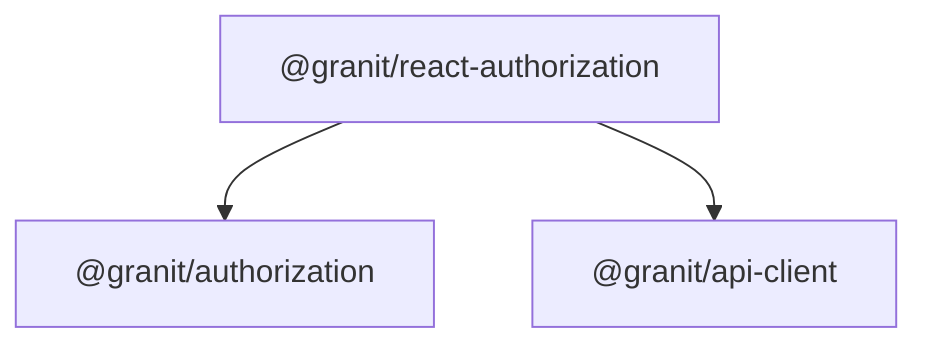

import { Tabs, TabItem, FileTree } from "@astrojs/starlight/components";

`@granit/authorization` defines permission and role types — DTOs for permission definitions,
grants, and groups. `@granit/react-authorization` provides React Query hooks for checking the
current user's permissions (with O(1) lookups), browsing the permission definitions tree, and
managing role-permission grants.

**Peer dependencies:** `axios`, `react ^19`, `@tanstack/react-query ^5`

## Package structure

<FileTree>
- @granit/authorization/ Permission types and DTOs (framework-agnostic)
  - @granit/react-authorization Permission hooks, query key factory, grant/revoke mutations
</FileTree>

| Package | Role | Depends on |
|---------|------|------------|
| `@granit/authorization` | Permission DTOs, option types | `axios` |
| `@granit/react-authorization` | `usePermissions`, `usePermissionDefinitions`, `usePermissionGrant` | `@granit/authorization`, `@tanstack/react-query`, `axios`, `react` |

## Dependency graph



## Setup

<Tabs>
<TabItem label="React (recommended)">

```tsx
import { usePermissions } from '@granit/react-authorization';
import { api } from './api-client';

function ProtectedButton() {
  const { hasPermission, isLoading } = usePermissions({ client: api });

  if (isLoading) return <Spinner />;
  if (!hasPermission('Invoices.Delete')) return null;

  return <button>Delete invoice</button>;
}
```

</TabItem>
<TabItem label="TypeScript only">

```ts
import type {
  PermissionDefinitionDto,
  PermissionGroupDto,
  PermissionGrantDto,
} from '@granit/authorization';

// Use the types to build your own permission layer (Angular, Vue, etc.)
```

</TabItem>
</Tabs>

## TypeScript SDK

### `PermissionsResponse`

```ts
type PermissionsResponse = {
  permissions: readonly string[];
};
```

### `PermissionDefinitionDto`

A single permission definition.

```ts
type PermissionDefinitionDto = {
  name: string;
  displayName: string | null;
};
```

### `PermissionGroupDto`

A group of related permissions (one per module).

```ts
type PermissionGroupDto = {
  name: string;
  displayName: string | null;
  permissions: readonly PermissionDefinitionDto[];
};
```

### `PermissionGrantDto`

Permissions granted to a specific role.

```ts
type PermissionGrantDto = {
  roleName: string;
  permissions: readonly string[];
};
```

### `PermissionGrantParams`

Parameters for grant/revoke mutations.

```ts
type PermissionGrantParams = {
  roleName: string;
  permissionName: string;
};
```

### Option types

```ts
type UsePermissionsOptions = {
  client: AxiosInstance;
  basePath?: string;   // default: '/api/v1/auth'
  enabled?: boolean;   // default: true
};

type UsePermissionDefinitionsOptions = {
  client: AxiosInstance;
  basePath?: string;
  enabled?: boolean;
};

type UseRolePermissionsOptions = {
  client: AxiosInstance;
  roleName: string;
  basePath?: string;
  enabled?: boolean;
};

type UsePermissionGrantOptions = {
  client: AxiosInstance;
  basePath?: string;
};
```

## React bindings

:::note[Framework-agnostic core]
All types above live in `@granit/authorization` — pure TypeScript with zero React dependency.
The React package below wraps these types into hooks.
:::

### Query key factory

```ts
const permissionKeys = {
  all: ['auth', 'permissions'] as const,
  me: (userId?) => [...permissionKeys.all, 'me', userId] as const,
  definitions: () => [...permissionKeys.all, 'definitions'] as const,
  role: (roleName) => [...permissionKeys.all, 'roles', roleName] as const,
};
```

### `usePermissions(options)`

Fetches the current user's granted permissions from `GET {basePath}/me` and returns a
`ReadonlySet<string>` for O(1) lookups.

```ts
function usePermissions(options: UsePermissionsOptions): UsePermissionsReturn;

type UsePermissionsReturn = {
  readonly permissions: ReadonlySet<string>;
  hasPermission: (permission: string) => boolean;
  hasAnyPermission: (permissions: readonly string[]) => boolean;
  hasAllPermissions: (permissions: readonly string[]) => boolean;
  readonly isLoading: boolean;
  readonly error: Error | null;
  readonly refetch: () => void;
};
```

**Caching:** `staleTime: Infinity` — permissions are cached for the lifetime of the Keycloak session.
Returns an empty set while loading (safe default: no access while uncertain).

```tsx
const { hasPermission, hasAnyPermission } = usePermissions({ client: api });

// Single permission check
if (hasPermission('Invoices.Delete')) { /* ... */ }

// Any of several permissions
if (hasAnyPermission(['Invoices.Read', 'Reports.Read'])) { /* ... */ }
```

### `usePermissionDefinitions(options)`

Fetches the complete permission definitions tree from `GET {basePath}/definitions`.
Used for admin UIs (role-permission matrix).

```ts
function usePermissionDefinitions(
  options: UsePermissionDefinitionsOptions
): UseQueryResult<PermissionGroupDto[]>;
```

Returns groups organized by module, each containing permission definitions with optional display names.
Cached with `staleTime: 5 minutes`.

### `useRolePermissions(options)`

Fetches permissions granted to a specific role from `GET {basePath}/roles/{roleName}`.

```ts
function useRolePermissions(
  options: UseRolePermissionsOptions
): UseQueryResult<PermissionGrantDto>;
```

URL-encodes `roleName` for safe handling of special characters (e.g. accented names).

### `usePermissionGrant(options)`

Provides mutations for granting and revoking individual permissions on a role.

```ts
function usePermissionGrant(options: UsePermissionGrantOptions): UsePermissionGrantReturn;

type UsePermissionGrantReturn = {
  readonly grant: UseMutationResult<void, Error, PermissionGrantParams>;
  readonly revoke: UseMutationResult<void, Error, PermissionGrantParams>;
};
```

**API contracts:**

| Action | HTTP method | Endpoint |
|--------|------------|----------|
| Grant | `PUT` | `{basePath}/roles/{roleName}/permissions/{permissionName}` |
| Revoke | `DELETE` | `{basePath}/roles/{roleName}/permissions/{permissionName}` |

Both mutations automatically invalidate `permissionKeys.role(roleName)` on success.

```tsx
const { grant, revoke } = usePermissionGrant({ client: api });

// Grant a permission
grant.mutate({ roleName: 'editor', permissionName: 'Invoices.Create' });

// Revoke a permission
revoke.mutate({ roleName: 'editor', permissionName: 'Invoices.Delete' });
```

## Public API summary

| Category | Key exports | Package |
|----------|-------------|---------|
| Permission types | `PermissionDefinitionDto`, `PermissionGroupDto`, `PermissionGrantDto`, `PermissionsResponse` | `@granit/authorization` |
| Option types | `UsePermissionsOptions`, `UsePermissionDefinitionsOptions`, `UseRolePermissionsOptions`, `UsePermissionGrantOptions` | `@granit/authorization` |
| User permissions | `usePermissions()`, `UsePermissionsReturn` | `@granit/react-authorization` |
| Admin hooks | `usePermissionDefinitions()`, `useRolePermissions()`, `usePermissionGrant()` | `@granit/react-authorization` |
| Query keys | `permissionKeys` | `@granit/react-authorization` |

## See also

- [Granit.Authorization module](/dotnet/security/authentication/) — .NET policy-based authorization
- [Authentication](./authentication/) — Must be authenticated before checking permissions
- [Identity](/frontend/security/identity/) — Provider capabilities may affect role management
